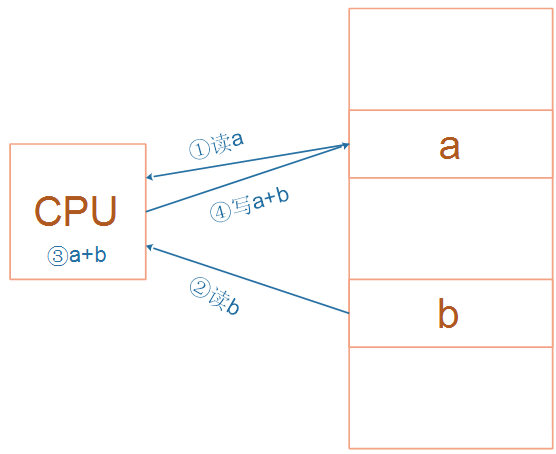
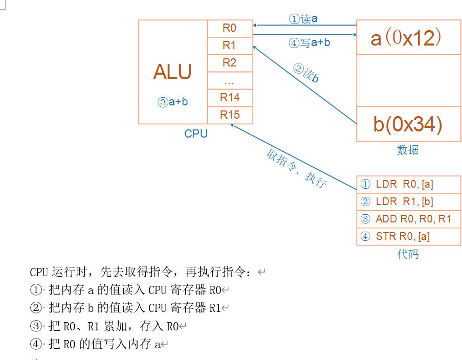

# 嵌入式开发C语言加强

## 0. 视频和源码对照表

| 序号 | 视频                          | 源码                                                         |
| ---- | ----------------------------- | ------------------------------------------------------------ |
| 1    | 01_变量和指针                 | 01_var_pointer                                               |
| 2    | 02_sizeof和关键字             | 02_print_sizeof<br />03_keyword                              |
| 3    | 03_struct                     | 04_struct<br />05_struct_space                               |
| 4    | 04_变量赋值                   | 06_var_give_val                                              |
| 5    | 05_通过指针赋值               | 07_pointer_give_val                                          |
| 6    | 06_上午答疑                   | 08_question                                                  |
| 7    | 07\_结构体指针\_函数指针      | 09_struct_pointer<br />10_function_pointer<br />11_use_lcd_by_macro<br />12_use_lcd_by_type<br />13_use_lcd_by_function_pointer |
| 8    | 08\_下午答疑\_关于指针        | 14_questions_pointer                                         |
| 9    | 09_链表                       | 15_list                                                      |
| 10   | 10_链表的插入操作             | 16_list_insert                                               |
| 11   | 11_链表的删除操作             | 17_list_remove                                               |
| 12   | 12_ARM架构和汇编初步体验      |                                                              |
| 13   | 13_全局变量的初始化和栈的引入 |                                                              |
| 14   | 14_局部变量的初始化           | 18_stack                                                     |
|      |                               |                                                              |


## 1. 变量与指针

2个口诀：

* 变量变量，能变，就是能读能写，必定在内存里
* 指针指针，保存的是地址，32位处理器中地址都是32位的，无论是什么类型的指针变量，都是4字节


## 2. 变量赋值

### 2.1 简单的变量赋值

```c
int a;
a = 1;
a = 'A';
```


### 2.2 关键字

* volatile
* const
* static
* extern


### 2.2 引入结构体、结构体赋值

* 


### 2.3 类型转换

int <=== char

struct <=== struct pointer


### 2.4 指针、函数指针


## 3. 链表操作


## 4. ARM架构







## 5. 几条汇编指令

* load
* store
* B、BL
* add、sub
* and/bic


## 6. 几个核心问题

* 有值的全局变量的初始化

  * 类似memcpy，把Flash上的数据段，整体拷贝到RAM

* 初始值为0、没有初始化的全局变量，怎么初始化？

  * 有100万个这样的变量
  * 这100万个变量，都保存在Flash上吗？
  * 这些变量在内存里都放在ZI段
  * 类似memset，把ZI段全部清零

* 才去调用main函数

* 局部变量在哪？

* 局部变量的初始化

* 栈的作用

  


