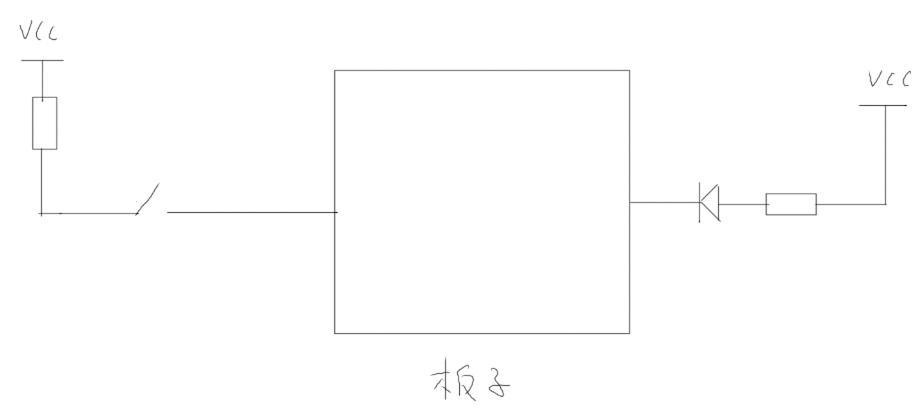
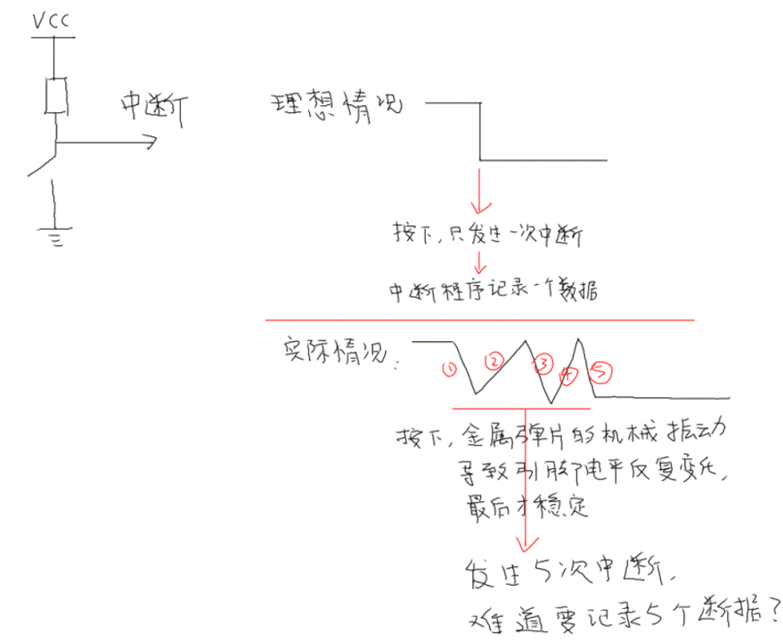
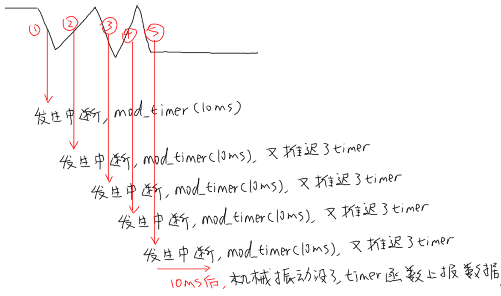

## 单片机项目课程_输入系统补课

本节源码：在GIT仓库中

```shell
rtos_doc_source\RTOS培训资料\
	01_项目1_基于HAL库实现智能家居\
		05_项目1_基于HAL库的智能家居\1_项目源码\10_6_input_unittest_debouncing
```

### 1. 单片机程序框架

单片机程序的3种写法：

#### 1.1 轮流执行

```c
int main()
{
    while (1)
    {
        A();
        B();
        C();
        D();
    }
}
```


#### 1.2 前后台

```c
void gpio_isr()
{
	put_data();
}

int main()
{
	while (1)
    {
    	if (get_data())
        {
	        do_something();
        }
    }
}
```


#### 1.3 多任务

```c
void productor_task()
{
    while (1)
    {
        if (has_data)
		    put_data();
    }
}

void consumer_task()
{
    while (1)
    {
        if (get_data())
		    do_something();
    }    
}

int main()
{
    create_task(productor_task);
    create_task(consumer_task);
    start_scheduler();
}
```


### 2. 轮流执行的程序怎么写？

出个题目，用按键控制LED：



#### 2.1 常规写法


#### 2.2 面向对象的写法

* 什么叫面向对象？
* 怎么抽象出结构体？


#### 2.3 为什么要面向对象？


### 3. 对于按键，怎么抽象出结构体？

* 框图
* InputEvent
* InputDevice


### 4. 我们之前写的程序，怎么使用定时器消除抖动？

#### 4.1 机械抖动




#### 4.2 怎么消除抖动？

* 硬件？
* 软件等待一会？
* 定时器？



### 5. 写程序


