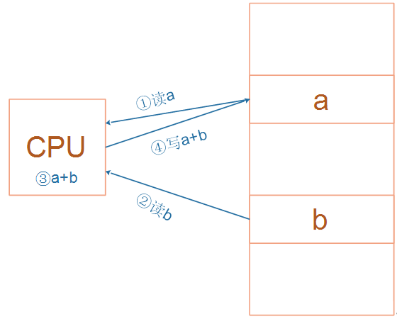
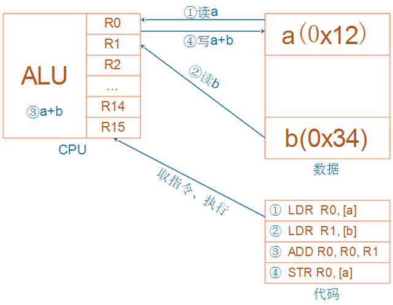
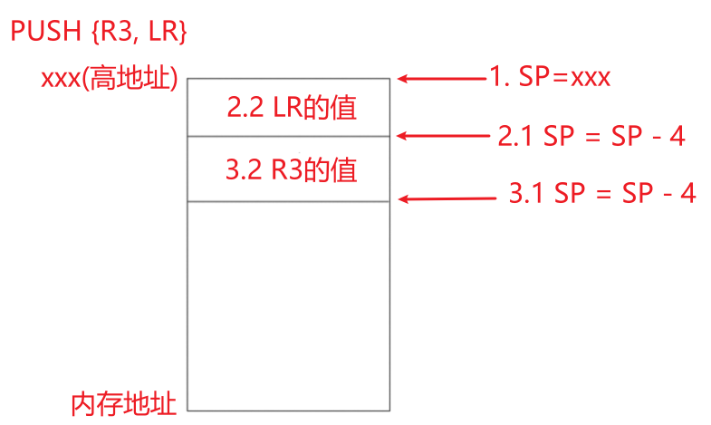
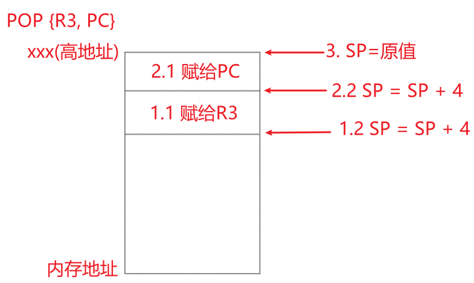
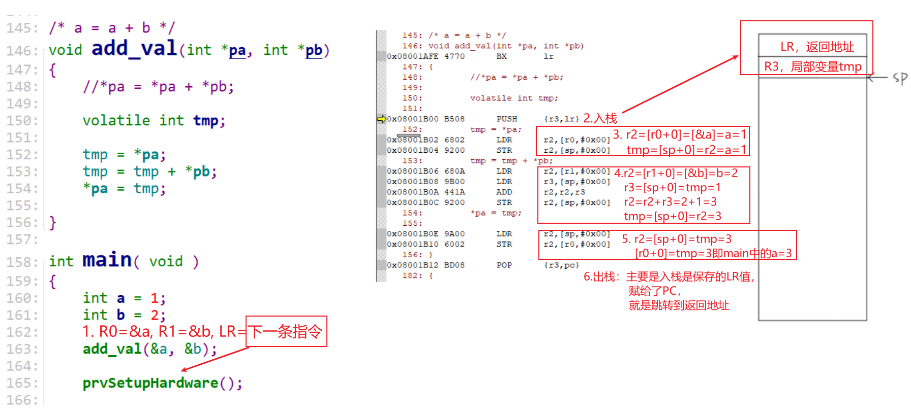
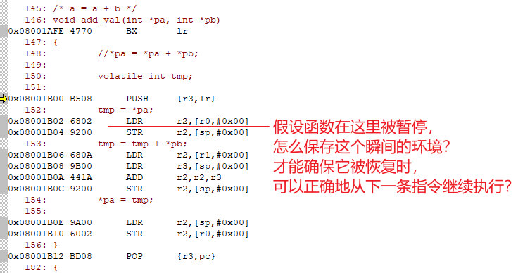
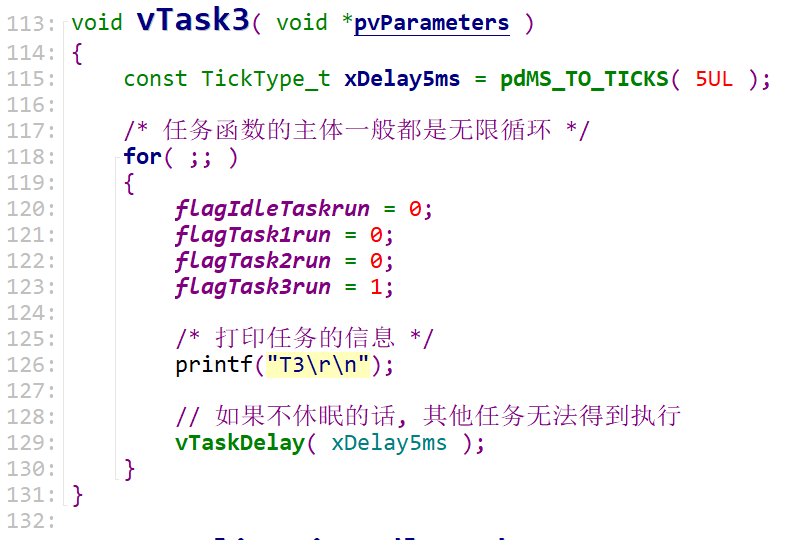

# 20211030直播_中度掌握FreeRTOS

## 1. RTOS的引入

### 1.1 用人来类比单片机程序和RTOS


妈妈要一边给小孩喂饭，一边加班跟同事微信交流，怎么办？

#### 1.1.1 我无法一心多用

对于单线条的人，不能分心、不能同时做事，她只能这样做：

* 给小孩喂一口饭
* 瞄一眼电脑，有信息就去回复
* 再回来给小孩喂一口饭
* 如果小孩吃这口饭太慢，她回复同事的信息也就慢了，被同事催：你半天都不回我？
* 如果回复同事的信息要写一大堆，小孩就着急得大哭起来。

这种做法，在软件开发上就是一般的单片机开发，没有用操作系统。


#### 1.2.2 我可以一心多用

对于眼明手快的人，她可以一心多用，她这样做：

* 左手拿勺子，给小孩喂饭
* 右手敲键盘，回复同事
* 两不耽误，小孩“以为”妈妈在专心喂饭，同事“以为”她在专心聊天
* 但是脑子只有一个啊，虽然说“一心多用”，但是谁能同时思考两件事？
* 只是她反应快，上一秒钟在考虑夹哪个菜给小孩，下一秒钟考虑给同事回复什么信息

 

这种做法，在软件开发上就是使用操作系统，在单片机里叫做使用RTOS。

RTOS的意思是：Real-time operating system，实时操作系统。

我们使用的Windows也是操作系统，被称为通用操作系统。使用Windows时，我们经常碰到程序卡死、停顿的现象，日常生活中这可以忍受。

但是在电梯系统中，你按住开门键时如果没有即刻反应，即使只是慢个1秒，也会夹住人。

在专用的电子设备中，“实时性”很重要。


### 1.2 程序简单示例

```c
// 经典单片机程序
void main()
{
	while (1)
    {
        喂一口饭();
        回一个信息();
    }
}
------------------------------------------------------
// RTOS程序    
喂饭()
{
    while (1)
    {
        喂一口饭();
    }
}

回信息()
{
    while (1)
    {
        回一个信息();
    }
}

void main()
{
    create_task(喂饭);
    create_task(回信息);
    start_scheduler();
    while (1)
    {
        sleep();
    }
}
```


## 2. 任务的引入

### 2.1 任务是什么

从这个角度想：函数被暂停时，我们怎么保存它、保存什么？怎么恢复它、恢复什么？

* 任务是一个函数吗？
  * 函数保存在Flash上
  * Flash上的函数无需再次保存
  * 所以：任务不仅仅是函数
* 任务时变量吗？
  * 单纯通过变量无法做事
  * 所以：任务不仅仅是变量
* 任务时一个运行中的函数
  * 运行中：可以曾经运行，现在暂停了，但是未退出
  * 怎么描述一个运行中的函数
  * 假设在某一个瞬间时间停止，你怎么记录这个运行中的函数
* 要立即任务的本质，需要理解ARM架构、汇编


### 2.2 理解C函数的内部机制

main函数的作用：

* 调用add_val
* 实现：a = a + b

分析add_val函数的内部实现，可以理解C函数的内部机制。

```c
/* a = a + b */
void add_val(int *pa, int *pb)
{
	//*pa = *pa + *pb;

	volatile int tmp;

	tmp = *pa;
	tmp = tmp + *pb;
	*pa = tmp;
	
}

int main( void )
{
	int a = 1;
	int b = 2;

	add_val(&a, &b);
	return 0;	
}
```


#### 2.2.1 ARM架构

ARM芯片属于精简指令集计算机(RISC：Reduced Instruction Set Computing)，它所用的指令比较简单，有如下特点：

* 对内存只有读、写指令
* 对于数据的运算是在CPU内部实现
* 使用RISC指令的CPU复杂度小一点，易于设计

 比如对于a=a+b这样的算式，需要经过下面4个步骤才可以实现：



 

细看这几个步骤，有些疑问：

* 读a，那么a的值读出来后保存在CPU里面哪里？
* 读b，那么b的值读出来后保存在CPU里面哪里？
* a+b的结果又保存在哪里？

 我们需要深入ARM处理器的内部。简单概括如下，我们先忽略各种CPU模式(系统模式、用户模式等等)。



CPU运行时，先去Flash上取得指令，再执行指令：

* 把内存a的值读入CPU寄存器R0
* 把内存b的值读入CPU寄存器R1
* 把R0、R1累加，存入R0
* 把R0的值写入内存a

怎么理解Flash上的指令？看下一节。


#### 2.2.2 汇编指令

本直播只需要记住5条汇编指令：

* 读内存：Load，LDR
* 写内存：Store，STR
* 加法：ADD
* 入栈：PUSH，实质上就是写内存STR
* 出栈：POP，实质上就是读内存LDR


要读内存：读内存哪个地址？读到的数据保存在哪里？读多少字节？

* LDR R0, [R1, #0x00]
  * 源地址：R1+0x00，注意：不是读R1，是把R1的值当做内存的地址
  * 目的：R0，CPU的寄存器
  * 长度：4字节，LDR指令就是读4字节，LDRH是读2字节，LDRB是读1字节


要写内存：写内存哪个地址？从哪里得到数据？写多少字节？

* STR R0, [R1, #0x00]
  * 目的地址：R1+0x00，注意：不是写R1，是把R1的值当做内存的地址
  * 源：R0，CPU的寄存器
  * 长度：4字节，STR指令就是读4字节，STRH是读2字节，STRB是读1字节


入栈：把CPU的寄存器的值，写到内存上

* PUSH {R3, LR}

  * 源：CPU的寄存器R3、LR的值
  * 目的：内存，内存哪里？使用CPU的SP寄存器指定内存地址
  * 长度：大括号里所有寄存器的数据长度，每个寄存器4字节
  * 注意：低编号的寄存器，保存在内存的低地址处
  * 执行结果如下
    

  


出栈：把内存中的数值，写到CPU的寄存器

* POP {R3, PC}
  * 源：内存，内存哪里？使用CPU的SP寄存器指定内存地址
  * 目的：CPU的寄存器R3、PC的值
  * 长度：大括号里所有寄存器的数据长度，每个寄存器4字节
  * 注意：内存的低地址处的数据，写到CPU低编号的寄存器
  * 执行结果如下
    


其他知识：

* CPU内部有R0、R1、……、R15共16个寄存器
* 某些寄存器有特殊作用
  * R13，别名SP，栈寄存器，保存着栈的地址
  * R14，别名LR，返回地址，保存着函数的返回地址
  * R15，别名PC，程序计数器，也就是当期程序运行到哪了


#### 2.2.3 运行流程分析




### 2.3 怎么保存函数的现场




#### 2.3.1 要保存什么

* 程序运行到了哪里？PC寄存器的值

* R2的值：我辛辛苦苦从内存里读到的值放在R2里，函数继续运行时，R2的值不要被破坏了

* 只需要保存R2吗？切换任务的话，所有的寄存器都要保存

* 保存在哪里？内存里! 内存哪里？栈里！

  

#### 2.3.2 保存现场的几种场景

* 函数调用

* 中断处理

* 任务切换

  


## 3. FreeRTOS中怎么创建任务

### 3.1 所需参数

### 3.2 参数详解

* 分配了TCB结构体
* 分配了栈
* 在栈里写入了函数地址、参数


## 4. 调度机制概述

### 4.1 优先级与状态

* 优先级不同
  * 高优先级的任务，优先执行，可以抢占低优先级的任务
  * 高优先级的任务不停止，低优先级的任务永远无法执行
  * 同等优先级的任务，轮流执行：时间片轮转
* 状态
  * 运行态：running
  * 就绪态：ready
  * 阻塞：blocked，等待某件事(时间、事件)
  * 暂停：suspend，休息去了
* 怎么管理？
  * 怎么取出要运行的任务？
    * 找到最高优先级的运行态、就绪态任务，运行它
    * 如果大家平级，轮流执行：排队，链表前面的先运行，运行1个tick后乖乖地去链表尾部排队


### 4.2 调度方法

* 谁进行调度？
  * TICK中断！


### 4.3 状态切换




## 5. 通过链表深入理解调度机制

* 可抢占：高优先级的任务先运行

* 时间片轮转：同优先级的任务轮流执行

* 空闲任务礼让：如果有同是优先级0的其他就绪任务，空闲任务主动放弃一次运行机会

  


