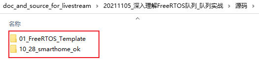
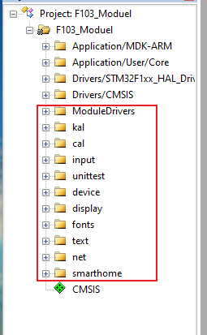
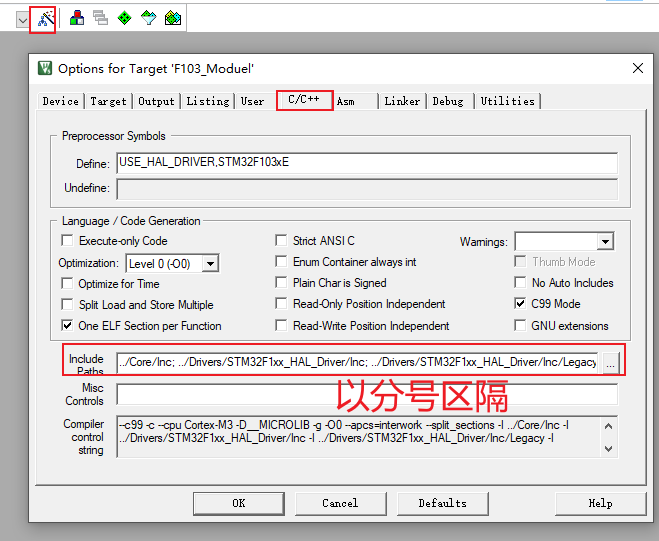

# 深入理解FreeRTOS队列_队列实战

## 1. 配套资料

GIT仓库：https://e.coding.net/weidongshan/livestream/doc_and_source_for_livestream.git

GIT使用说明：https://download.100ask.org/tools/Software/git/how_to_use_git.html


## 2. 预习视频

[01_cubemx创建FreeRTOS的工程模板](https://www.100ask.net/detail/v_6184e111e4b07ededa9bbedc/3)

这视频是免费的，登录http://www.100ask.net后，

打开链接即可观看：https://www.100ask.net/detail/v_6184e111e4b07ededa9bbedc/3


## 3. 预习源码




## 4. 使用链表来理解任务调度的机制


## 5. 使用链表来理解队列的机制


## 6. 队列的实际使用

### 6.1 合并代码

`10_28_smarthome_ok` ==> `01_FreeRTOS_Template`

* 复制smartdevice
* 复制ModuleDrivers
* 编译
  * keil工程里添加文件
    

* 指定头文件目录：加入下列目录

  ```shell
  ../smartdevice/cal;../smartdevice/kal;../smartdevice/input;../smartdevice/unittest;../smartdevice/device;../smartdevice/device/display;../smartdevice/config;../smartdevice/fonts;../smartdevice/text;../smartdevice/net;../smartdevice/device/uart;../smartdevice/smarthome
  ```

  

* 再次编译

  ```shell
  F103_Moduel\F103_Moduel.axf: Error: L6200E: Symbol USART3_IRQHandler multiply defined (by driver_usart.o and stm32f1xx_it.o).
  
  F103_Moduel\F103_Moduel.axf: Error: L6200E: Symbol ascii_font multiply defined (by ascii_font_1.o and ascii_font.o).
  ```

* 在工程里删除: ModuleDrivers/ascii_font.c

* 修改Core\Src\stm32f1xx_it.c，去掉`USART3_IRQHandler`