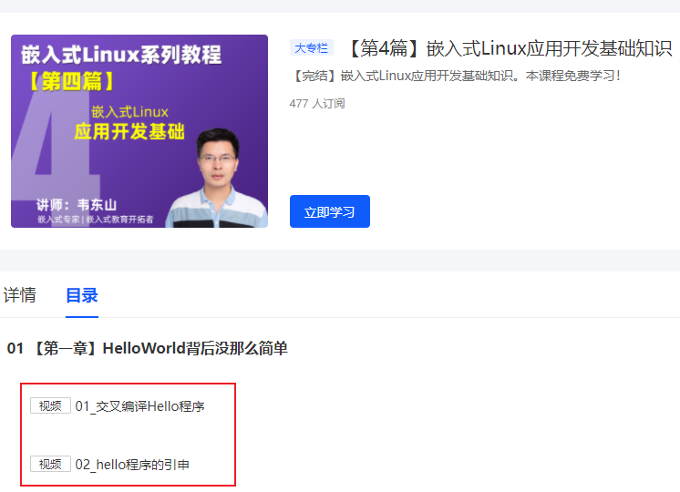
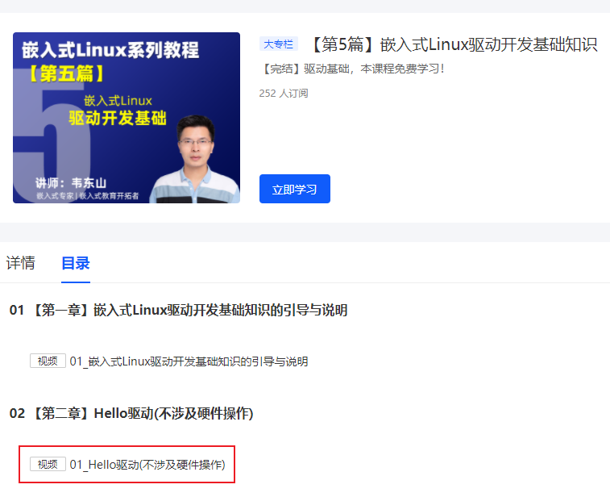
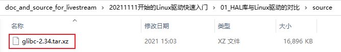
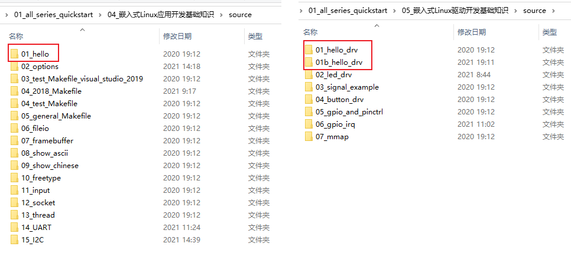

## 单片机程序和Linux程序从上层到底层的完整比较

Linux在线培训班的预习资料等，放在GIT仓库里。

GIT仓库地址：https://e.coding.net/weidongshan/livestream/doc_and_source_for_livestream.git

GIT使用说明：https://download.100ask.org/tools/Software/git/how_to_use_git.html

**注意**：GIT仓库地址无法在浏览器中直接访问，必须使用GIT工具。

### 1. 预习资料

#### 1.1 第1个Linux应用程序

在百问网中：http://www.100ask.net

#### 1.2 第1个Linux驱动程序

在百问网中：http://www.100ask.net

### 2. 课程用到的代码

#### 2.1 GLIBC

地址：https://www.gnu.org/software/libc/

源码：glibc-2.34.tar.xz

也可以在我们的GIT仓库里得到此源码

地址：https://e.coding.net/weidongshan/livestream/doc_and_source_for_livestream.git

#### 2.2 Linux内核源码

你用任何开发板，都会有对应手册教你从哪里得到板子对应的源码。

#### 2.3 第1个应用程序、驱动程序

GIT仓库：https://e.coding.net/weidongshan/01_all_series_quickstart.git

### 3. 准备好查看源码的工具

推荐使用souce insight。