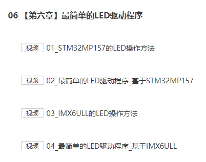
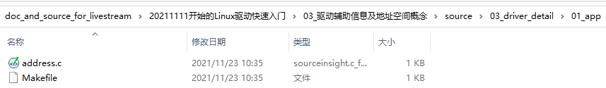

## 驱动辅助信息及地址空间概念

Linux在线培训班的预习资料等，放在GIT仓库里。

GIT仓库地址：https://e.coding.net/weidongshan/livestream/doc_and_source_for_livestream.git

GIT使用说明：https://download.100ask.org/tools/Software/git/how_to_use_git.html

**注意**：GIT仓库地址无法在浏览器中直接访问，必须使用GIT工具。

### 1. 预习资料

#### 1.1 观看视频

观看视频：https://www.100ask.net/detail/p_5f1aa2dde4b0df48afbd775f/8

你用哪个板子，就看对应的视频：



#### 1.2 思考

GIT仓库中有如下程序：




address.c源码如下：

```c

#include <stdio.h>
#include <stdlib.h>
#include <unistd.h>

int a;

int main(int argc, char **argv)
{
	if (argc != 2)
	{
		printf("Usage: %s <val>\n", argv[0]);
		return -1;
	}

	a = strtol(argv[1], NULL, 0);
	printf("a = %d\n", a);
	printf("a's address = 0x%lx\n", (unsigned long)&a);
	printf("main's address = 0x%lx\n", (unsigned long)main);
	
	while (1)
	{
		sleep(100);
	}
	return 0;
}
```


把它放到Ubuntu后，执行：

```shell
make
$ ./address 124&
a = 124
a's address = 0x6bc3a0
main's address = 0x400b5d

$ ./address 123&
a = 123
a's address = 0x6bc3a0
main's address = 0x400b5d
```


观察到：现在内存里有2个address程序，它们的变量a地址相同、值不同

问：为什么同一个地址的内存里，同一时间点，竟然值不一样？


### 2. 数据传输

继续上节的内容。

#### 2.1 APP和驱动间传输数据

APP无法直接访问内核：否则内核态容易被破坏了。

APP也就无法传递数据给驱动，驱动属于内核的一部分。

驱动也无法直接方位APP的变量。

驱动要访问APP的数据，必须使用这2个函数：

* copy_to_user
* copy_from_user

#### 2.2 驱动和硬件间传输数据

要引入地址空间的概念。


### 3. 地址空间

* CPU怎么访问多个外设
* 为什么要引入虚拟地址
* 虚拟地址怎么对应到物理地址
* Linux驱动中怎么访问硬件寄存器


### 4. 驱动程序辅助信息

自动创建设备节点的流程：

* 内核提供信息
  * class_create
  * device_create
* APP根据信息创建设备节点

