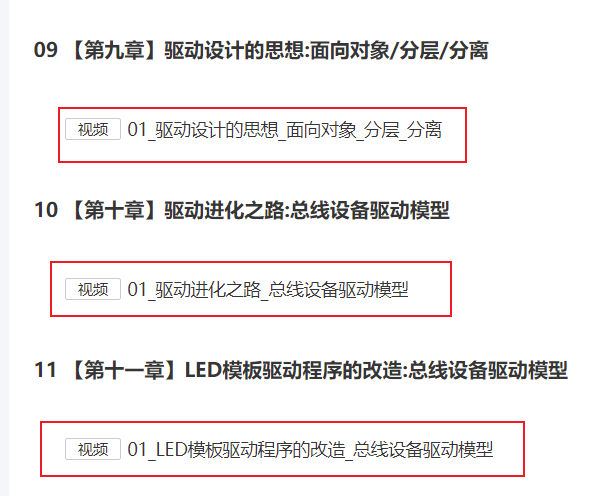
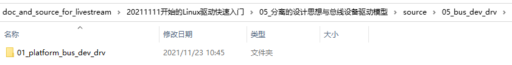

## 分离的设计思想与总线设备驱动模型

Linux在线培训班的预习资料等，放在GIT仓库里。

GIT仓库地址：https://e.coding.net/weidongshan/livestream/doc_and_source_for_livestream.git

GIT使用说明：https://download.100ask.org/tools/Software/git/how_to_use_git.html

**注意**：GIT仓库地址无法在浏览器中直接访问，必须使用GIT工具。


### 1. 预习视频





### 2. 示例代码

代码在GIT仓库中：




测试方法：

* 把代码上传到Ubuntu

* 执行如下命令

  ```shell
  make
  sudo insmod hello_drv.ko
  sudo insmod hello_dev.ko
  dmesg
  ```

* 分析函数调用过程


### 3. 思考

* 总线设备驱动模型的意义是什么？
* platform_driver是驱动程序吗？
* platform_device是设备吗？

