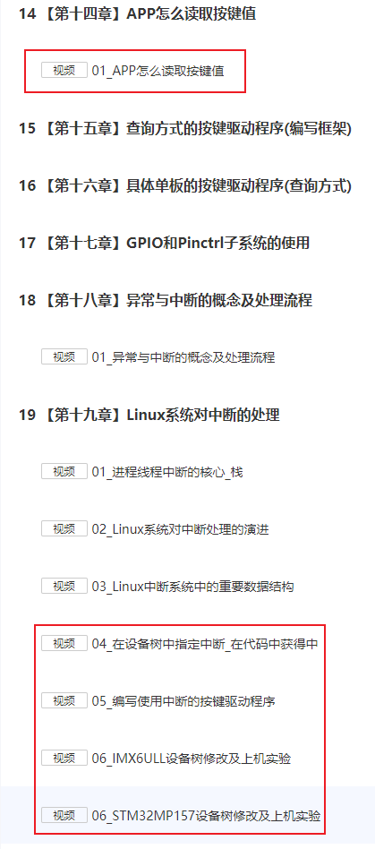

## 应用程序和驱动程序的更多交互方式

Linux在线培训班的预习资料等，放在GIT仓库里。

GIT仓库地址：https://e.coding.net/weidongshan/livestream/doc_and_source_for_livestream.git

GIT使用说明：https://download.100ask.org/tools/Software/git/how_to_use_git.html

**注意**：GIT仓库地址无法在浏览器中直接访问，必须使用GIT工具。

### 1. 预习视频

继续讲解上次的内容，预习的视频是一样的：

