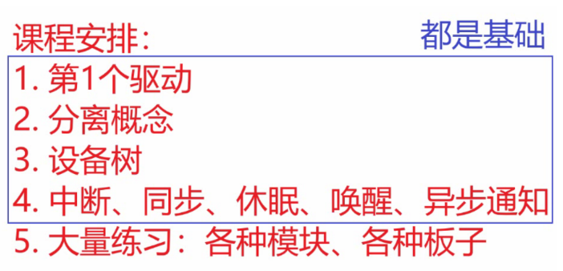
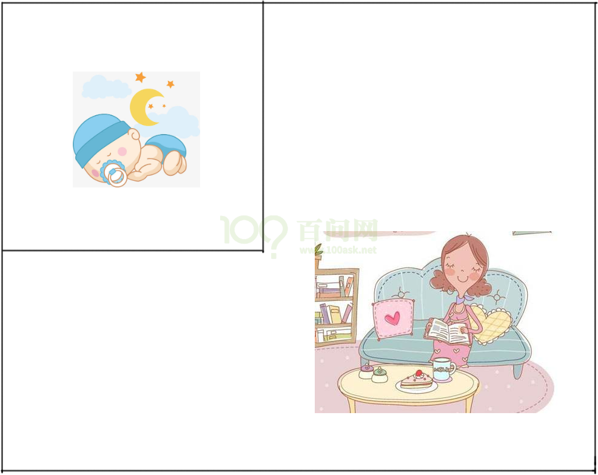
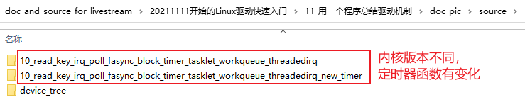

# 用一个程序总结驱动机制

## 1. 特别说明

这次课讲完后，我们的基础课程就讲完了，后面就是大量的练习：使用更多板子、更多模块来练习。

## 2. APP和驱动交互方式

 

妈妈怎么知道卧室里小孩醒了？

* 时不时进房间看一下：查询方式
  * 简单，但是累
* 进去房间陪小孩一起睡觉，小孩醒了会吵醒她：休眠-唤醒
  * 不累，但是妈妈干不了活了

* 妈妈要干很多活，但是可以陪小孩睡一会，定个闹钟：poll方式
  * 要浪费点时间，但是可以继续干活
  * 妈妈要么是被小孩吵醒，要么是被闹钟吵醒。

* 妈妈在客厅干活，小孩醒了他会自己走出房门告诉妈妈：异步通知
  * 妈妈、小孩互不耽误。

##  3. 用一个程序来演示这4种方法

