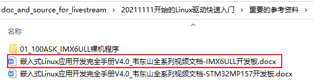
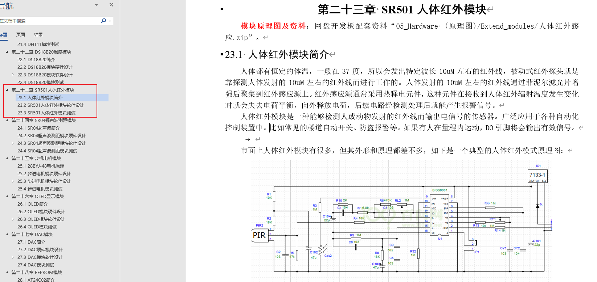
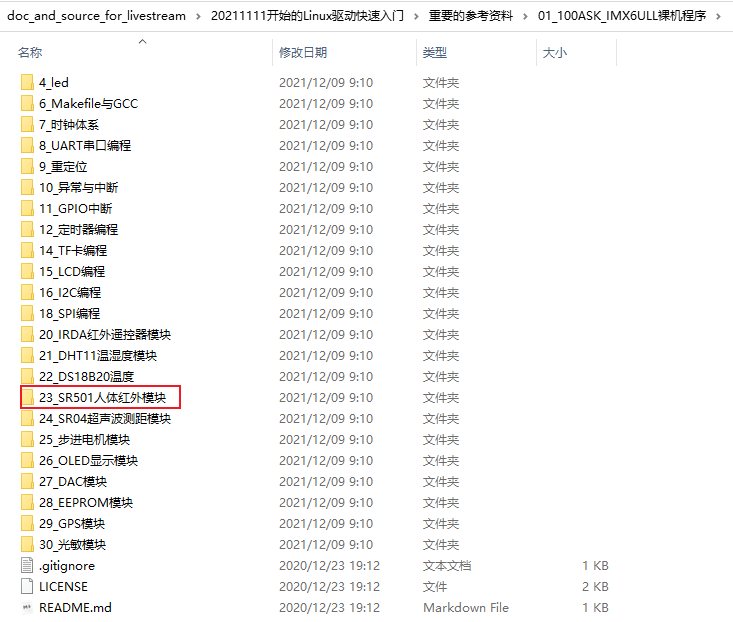

# 实战_SR501人体红外模块驱动开发

Linux在线培训班的预习资料等，放在GIT仓库里。

GIT仓库地址：https://e.coding.net/weidongshan/livestream/doc_and_source_for_livestream.git

GIT使用说明：https://download.100ask.org/tools/Software/git/how_to_use_git.html

**注意**：GIT仓库地址无法在浏览器中直接访问，必须使用GIT工具。

## 1. 实战直播开始了

实战课程会涉及如下内容：

| 模块                 | 要点                                                         |
| -------------------- | ------------------------------------------------------------ |
| 1. SR501人体红外模块 | 两种方法：使用中断、使用内核线程                             |
| 2.SR04超声波测距模块 | 中断+高精度计时器                                            |
| 3.DHT11温湿度模块    | 输出精确的脉冲，使用中断和高精度计时器解析数据               |
| 4.DS18B20温度模块    | 使用一根引脚实现更复杂的协议                                 |
| 5.IRDA红外遥控模块   | 两种方法：自己写(中断+高精度计时器+解析数据包)，内核自带的驱动 |
| 6.I2C接口驱动程序    | 设备树、I2C Device驱动程序                                   |
| 7.SPI接口驱动程序    | 分析SPI总线驱动、确定片选引脚、编写SPI Device驱动            |
| 8.LCD驱动程序移植    | 分析驱动、修改设备树                                         |
| 9.触摸屏驱动程序移植 | 分析驱动，掌握输入系统中驱动层次、APP用法                    |

实战课程里面，我不会一直讲讲讲，而是提供思路，让同学们自己写程序。

不是我一个人讲，你们光听不练。

一个驱动，可能会用2、3次直播才能完成。

我们只有18次直播了，不一定能讲完上述内容，如果讲不完，我们就加课！

## 2. 预习资料

看文档即可，文档在GIT仓库里：

* 《嵌入式Linux应用开发完全手册V4.0_韦东山全系列视频文档-IMX6ULL开发板.docx》
  * 《第13篇 IMX6ULL裸机开发》
    * 《第二十三章 SR501人体红外模块》

对应的源码也在GIT仓库里：

## 3. 编写驱动

* 编写设备树
* 编写驱动框架
  * 方法1：使用中断
  * 方法2：假设没有中断，使用内核线程

