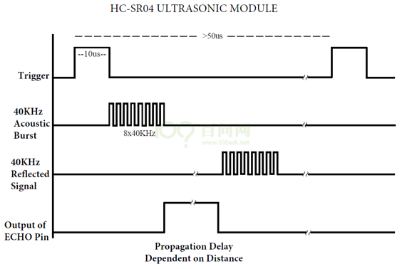

# SR04超声波测距模块驱动程序的两种写法

* 内核线程
  * 参考函数：kernel_thread、kthread_create、 kthread_run
  * 参考文章：https://blog.csdn.net/qq_37858386/article/details/115573565


## 1. SR04工作原理



要测距，需如下操作：

* 触发：向Trig（脉冲触发引脚）发出一个大约10us的高电平。
  * 模块就自动发出8个40Khz的超声波，超声波遇到障碍物后反射回来，模块收到返回来的超声波。

* 回响：模块接收到反射回来的超声波后，Echo引脚输出一个与检测距离成比例的高电平。
* 我们只要计算Echo引脚维持高电平的时间T即刻计算举例：D = 340*T/2。


## 2. 编写驱动程序的思路

假设举例是2mm的话，T = 0.002 * 2  / 340 = 2.95 us。

测量距离时想达到很高的精度，关键在于得到很精确的时间。


### 2.1 方法1

```c
int us = 0;

local_irq_save(flags);    // 关中断

//使用udelay来延时判断引脚电平
while (低电平); // 等待高电平
while (高电平){ udelay(1); us++; }  // 累加时间

local_irq_restore(flags); // 恢复中断
```


### 2.2 方法2

设置Echo中断为双边沿触发，在上升沿读取时间T1，在下降沿读取时间T2：T2-T1就是高电平的时间。

关键在于：使用什么函数读取时间？


内核在启动时，定时器便开始计数，通过获取计数，可计算得出运行时间。

获取时间函数如下：

```c
ktime_get_ns();          // 获取内核启动到现在的时间，在挂起时会暂停
ktime_get_boottime_ns(); // 获取内核启动到现在的时间，不受挂起影响，是绝对时间
ktime_get_real_ns();     // 获取Unix时间(1970年)到现在的时间，可能涉及闰秒更新，用得比较少
ktime_get_raw_ns();      // 类似ktime_get_ns(),不涉及闰秒更新，用得比较少
```


参考文档：https://www.kernel.org/doc/html/latest/core-api/timekeeping.html#c.ktime_get_ns
