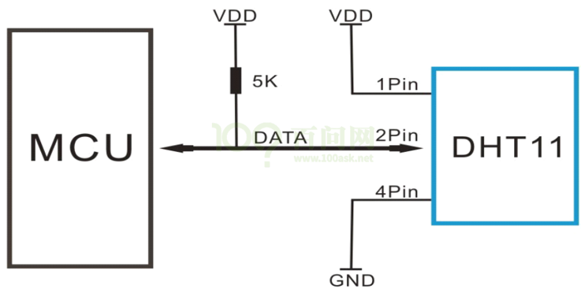
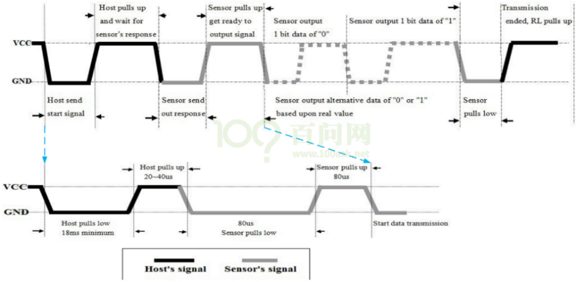
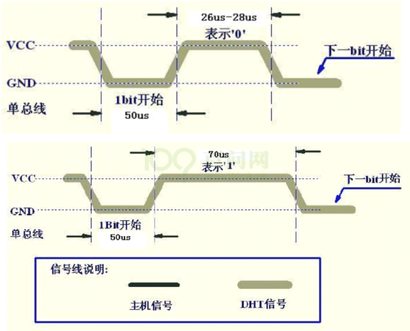
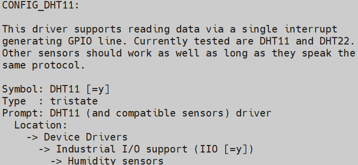

# DHT11温湿度传感器驱动程序的3种写法

* 内核线程
  * 参考函数：kernel_thread、kthread_create、 kthread_run
  * 参考文章：https://blog.csdn.net/qq_37858386/article/details/115573565


## 1. DHT11工作原理

### 1.1 硬件信号



需要先发一个开始信号给DHT11，才能接收数据。

下图为一次完整的传输示例，其中深黑色信号表示由主机驱动，即主机向DHT11发信号，浅灰色信号表示DHT11驱动，即DHT11发向主机发信号。



当主机没有与DHT11通信时，总线处于空闲状态，此时总线电平由于上拉电阻的作用处于高电平。

当主机与DHT11正在通信时，总线处于通信状态，一次完整的通信过程如下：

* 主机将对应的GPIO管脚配置为输出，准备向DHT11发送数据；
*  主机发送一个开始信号：
  * 开始信号 = 一个低脉冲 + 一个高脉冲。低脉冲至少持续18ms，高脉冲持续20-40us。

* 主机将对应的GPIO管脚配置为输入，准备接受DHT11传来的数据，这时信号由上拉电阻拉高；
* DHT11发出响应信号：
  * 响应信号 = 一个低脉冲 + 一个高脉冲。低脉冲持续80us，高脉冲持续80us。

* DHT11发出数据信号：
  * 数据为0的一位信号 = 一个低脉冲 + 一个高脉冲。低脉冲持续50us，高脉冲持续26～28us。
  * 数据为1的一位信号 = 一个低脉冲 + 一个高脉冲。低脉冲持续50us，高脉冲持续70us。

* DHT11发出结束信号：
  * 最后1bit数据传送完毕后，DHT11拉低总线50us，然后释放总线，总线由上拉电阻拉高进入空闲状态。

​                               

###  1.2 数据格式

数据格式: 

```shell
8bit湿度整数数据+8bit湿度小数数据
+8bi温度整数数据+8bit温度小数数据
+8bit校验和
```

数据传送正确时,校验和等于“8bit湿度整数数据+8bit湿度小数数据+8bi温度整数数据+8bit温度小数数据”所得结果的末8位。

 

## 2. 编程思路

有了上述基础知识后就可以开始编写程序了。

编程思路如下：

* 设置好GPIO；
* 主机把GPIO设置为输出引脚，发送开始信号，然后把GPIO设置为输入引脚；
* 主机判断是否收到DHT11的回应信号；
* 接收到回应信号后，开始读取数据；
* 接收完数据后，校验、解析。


关键在于如何得到一位数据，看看下图：

* 先等待低电平结束，一直等到出现高电平；然后延时40us，读取GPIO值：这就是该位的数据值。

 


## 3. 编写驱动程序


### 3.1 方法1: 查询方式

触发DHT11转换数据后，就把引脚配置为输入引脚，检测引脚的电平变化，并记录高低电平的时间，最后解析出温湿度。

**注意**：要关闭中断。

示例代码：

```c
int dht11_read_byte()
{
    //使用udelay来延时判断引脚电平
    while (低电平); // 等待高电平
    while (高电平){ udelay(1); us++; }  // 累加时间
}

int us = 0;

local_irq_save(flags);    // 关中断
val1 = dht11_read_byte();
val2 = dht11_read_byte();
tmp1 = dht11_read_byte();
tmp2 = dht11_read_byte();
crc  = dht11_read_byte();
local_irq_restore(flags); // 恢复中断
```


### 3.2 方法2: 中断方式

触发DHT11转换数据后，就把引脚配置为输入引脚，并注册中断：在中断函数中记录上升沿、下降沿的实际，解析出温湿度。

获取时间函数如下：

```c
ktime_get_ns();          // 获取内核启动到现在的时间，在挂起时会暂停
ktime_get_boottime_ns(); // 获取内核启动到现在的时间，不受挂起影响，是绝对时间
ktime_get_real_ns();     // 获取Unix时间(1970年)到现在的时间，可能涉及闰秒更新，用得比较少
ktime_get_raw_ns();      // 类似ktime_get_ns(),不涉及闰秒更新，用得比较少
```


参考文档：https://www.kernel.org/doc/html/latest/core-api/timekeeping.html#c.ktime_get_ns


### 3.3 方法3: 使用IIO子系统

内核已经自带DHT11的驱动程序：`drivers/iio/humidity/dht11.c`：

* 配置内核
  

* 编写设备树，参考`Documentation\devicetree\bindings\iio\humidity\dht11.txt`

  ```shell
  // imx6ull
  humidity_sensor { compatible = "dht11";
  	gpios = <&gpio4 19 0>; 
  };
  
  // stm32mp157
  humidity_sensor { compatible = "dht11";
  	gpios = <&gpioa 5 0>; 
  };
  ```

  

怎么使用？

```shell
cat /sys/bus/iio/devices/iio:device1/in_temp_input
cat /sys/bus/iio/devices/iio:device1/in_humidityrelative_input
```

