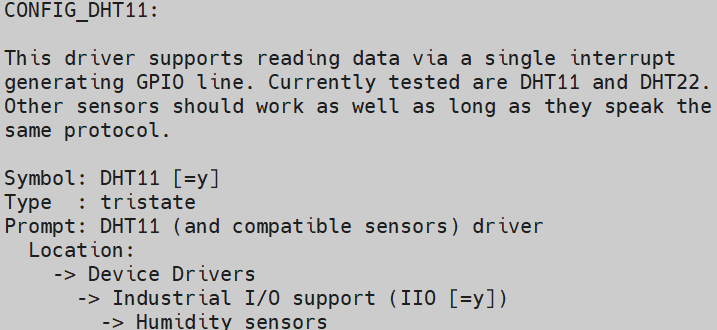

# DHT11驱动实现_中断方式和IIO系统

* 内核线程
  * 参考函数：kernel_thread、kthread_create、 kthread_run
  * 参考文章：https://blog.csdn.net/qq_37858386/article/details/115573565


## 1.  中断方式

触发DHT11转换数据后，就把引脚配置为输入引脚，并注册中断：在中断函数中记录上升沿、下降沿的实际，解析出温湿度。

获取时间函数如下：

```c
ktime_get_ns();          // 获取内核启动到现在的时间，在挂起时会暂停
ktime_get_boottime_ns(); // 获取内核启动到现在的时间，不受挂起影响，是绝对时间
ktime_get_real_ns();     // 获取Unix时间(1970年)到现在的时间，可能涉及闰秒更新，用得比较少
ktime_get_raw_ns();      // 类似ktime_get_ns(),不涉及闰秒更新，用得比较少
```


参考文档：https://www.kernel.org/doc/html/latest/core-api/timekeeping.html#c.ktime_get_ns


## 2. 使用IIO子系统

内核已经自带DHT11的驱动程序：`drivers/iio/humidity/dht11.c`：

* 配置内核
  

* 编写设备树，参考`Documentation\devicetree\bindings\iio\humidity\dht11.txt`

  ```shell
  // imx6ull
  humidity_sensor { compatible = "dht11";
  	gpios = <&gpio4 19 0>; 
  };
  
  // stm32mp157
  humidity_sensor { compatible = "dht11";
  	gpios = <&gpioa 5 0>; 
  };
  ```

  

怎么使用？

```shell
cat /sys/bus/iio/devices/iio:device1/in_temp_input
cat /sys/bus/iio/devices/iio:device1/in_humidityrelative_input
```

