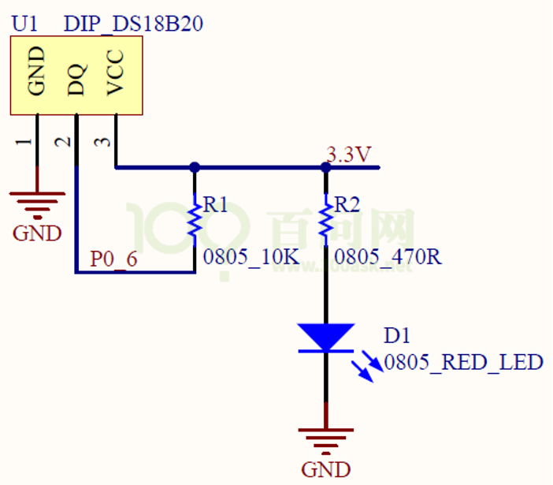
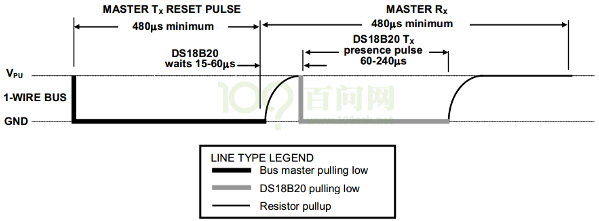
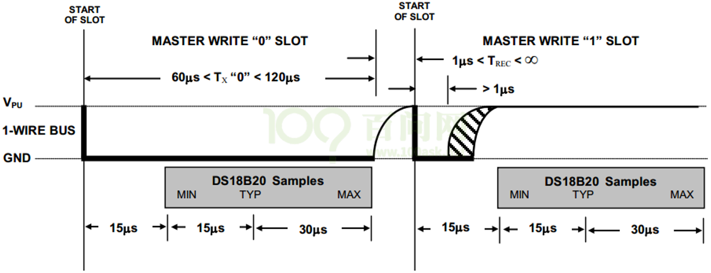
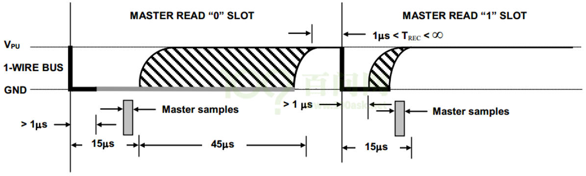

# DS18B20驱动编程

* 内核线程
  * 参考函数：kernel_thread、kthread_create、 kthread_run
  * 参考文章：https://blog.csdn.net/qq_37858386/article/details/115573565


## 1.  硬件连接




## 2. 访问流程

在一条数据线上，可以连接多个DS18B20。每个DS18B20都内嵌不同的ID，所以需要先选择某个DS18B20。

如果只有一个DS18B20，就不需要选择。

访问DS18B20的流程为：启动温度转换、读取温度。

怎么启动温度转换？方法如下：

* 发出Start信号
* 得到回应
* 发出8位的数据，用于选择某个DS18B20
* 发出温度转换命令
* 等待温度转换完毕

温度转换完毕后，数据存在DS18B20内部的暂存器中。怎么读出数据？方法如下：

* 发出Start信号
* 得到回应
* 发出8位的数据，用于选择某个DS18B20
* 发出读暂存器的命令
* 读温度低8位
* 读温度高8位


## 3. 硬件信号

### 3.1 Start和回应

深黑色线表示由主机驱动信号，浅灰色线表示由DS18B20驱动信号。

最开始时引脚是高电平，想要开始传输信号：

* 必须要拉低至少480us，这是复位信号；
* 然后拉高释放总线，等待15~60us之后，
* 如果GPIO上连有DS18B20芯片，它会拉低60~240us：这就是回应

如果主机在最后检查到60～240us的低脉冲回应信号，则表示DS18B20初始化成功。




### 3.2 写一位数据

如果写0，拉低至少60us(写周期为60-120us)即可；

如果写1，先拉低至少1us，然后拉高，整个写周期至少为60us即可。




### 3.3 读一位数据

主机先拉低至少1us，随后读取电平，如果为0，即读到的数据是0，如果为1，即可读到的数据是1。

整个过程必须在15us内完成，15us后引脚都会被拉高。



## 4. DS18B20内部寄存器

参考：

```shell
《嵌入式Linux应用开发完全手册V4.0_韦东山全系列视频文档-IMX6ULL开发板.docx》
	第13篇 IMX6ULL裸机开发
		第二十二章 DS18B20温度模块
```


## 5. 编写驱动程序


