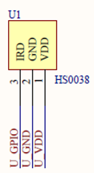
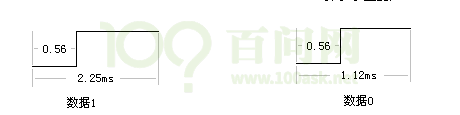
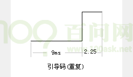
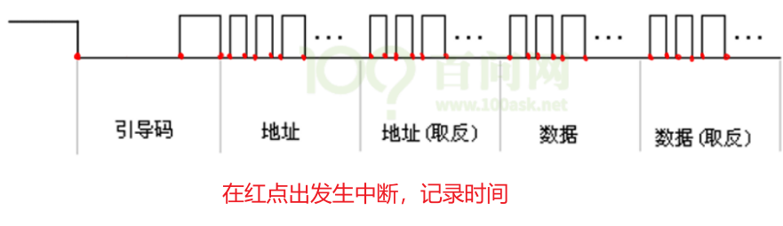

# 红外遥控器HS0038的两种驱动程序

## 1.  硬件连接

## 2. 通信协议

我们按下遥控器按键的时候，遥控器自动发送某个红外信号，接收头接收到红外信号，然后把红外信号转换成电平信号，通过IRD这根线，传给SOC。整个传输，只涉及单向传输，由HS0038向主芯片传送。

因此，我们只需要编写程序，从IRD上获取数据即可，在这之前，我们需要先了解下数据是怎么表示的，也就是传输的红外数据的格式。

红外协议有：NEC、SONY、RC5、RC6等，常用的就是NEC格式，因此我们主要对NEC进行讲解。

在分析文章中的波形之前，我们先想象一下怎么在一条数据线上传输信号。

开始传输数据之前，一般都会发出一个start起始信号，通知对方我开始传输数据了，后面就是每一位每一位的数据。

NEC协议的开始是一段引导码：

这个引导码由一个9ms的低脉冲加上一个4.5ms的高脉冲组成，它用来通知接收方我要开始传输数据了。

然后接着的是数据，数据由4字节组成：地址、地址(取反)、数据、数据(取反)，取反是用来校验用的。

地址是指遥控器的ID，每一类遥控器的ID都不一样，这样就可以防止操控电视的遥控器影响空调。数据就是遥控器上的不同按键值。

从前面的图可以知道，NEC每次要发32位（地址、地址取反、数据、数据取反，每个8位）的数据。数据的1和0，开始都是0.56ms的低脉冲，对于数据1，后面的高脉冲比较长，对于数据0，后面的高脉冲比较短。

第一次按下按键时，它会发出引导码，地址，地址取反，数据，数据取反。

如果这时还没松开按键，这就是“长按”，怎么表示“长按”？遥控器会发送一个不一样的引导码，这个引导码由9ms的低脉冲，2.25ms的高脉冲组成，表示现在按的还是上次一样的按键，也叫连发码，它会一直发送，直到松开。

## 3. 编程思路

使用中断来实现：

* GPIO引脚配置为双边沿触发中断
* 记录中断发生时的时间
* 等接到完整的中断后，解析数据

