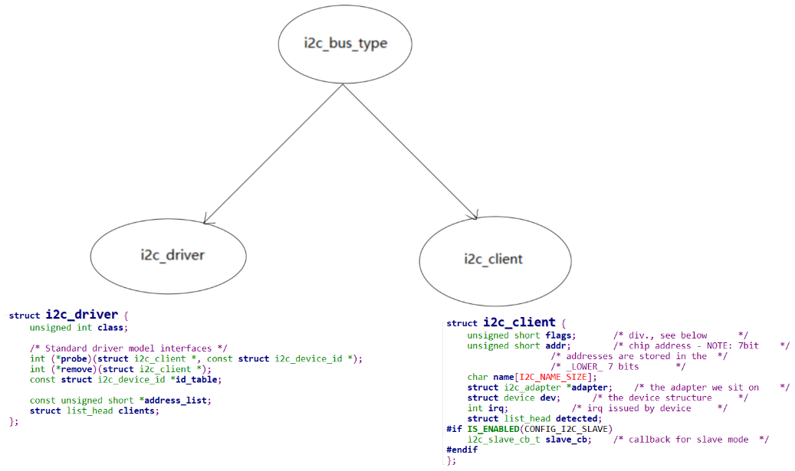

# I2C设备驱动程序开发1_AT24C02


## 1.  I2C总线设备驱动模型





## 2. 怎么写I2C设备驱动程序

### 2.1 在DTS构造节点

怎么描述一个I2C设备？

* 它挂在哪条I2C总线下？
* 它的I2C设备地址是多少？

示例：

```shell
&i2c0 {
        at24c04@50 {
                compatible = "atmel,24c04";
                reg = <0x50>;
        };
};	
```


### 2.2 编写i2c_driver


