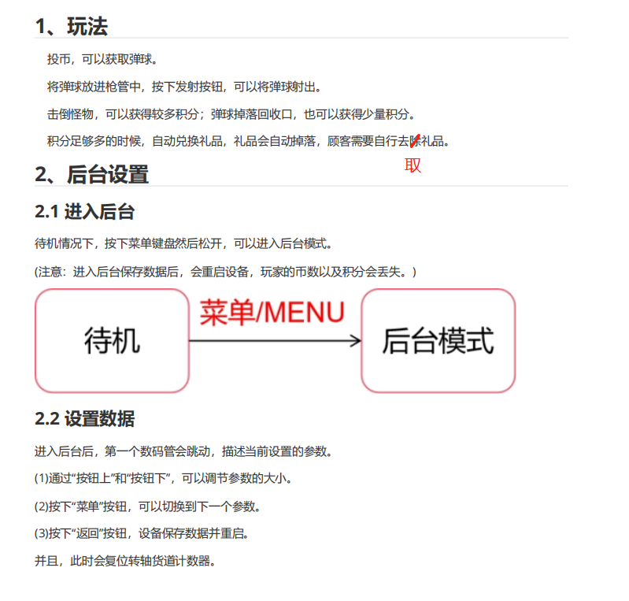
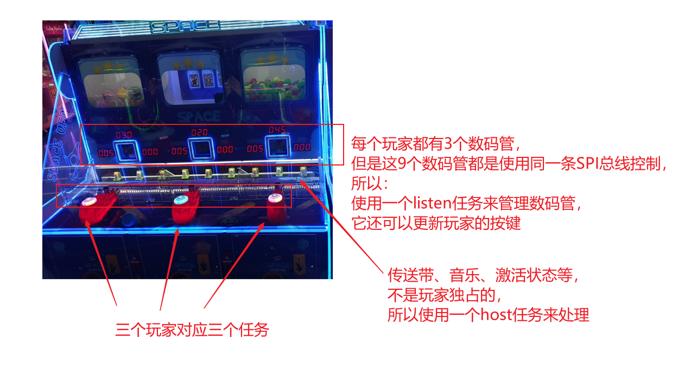
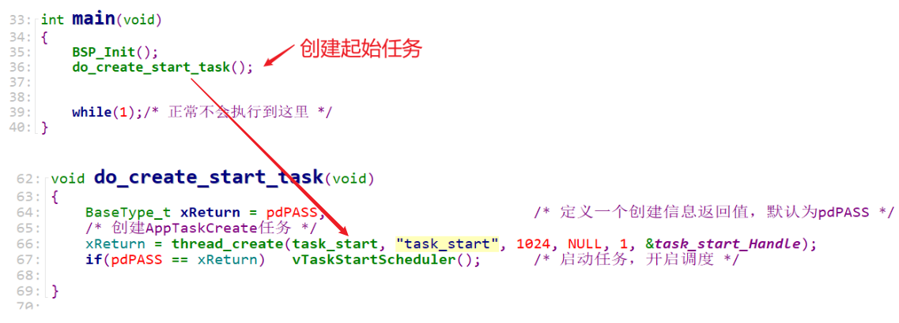
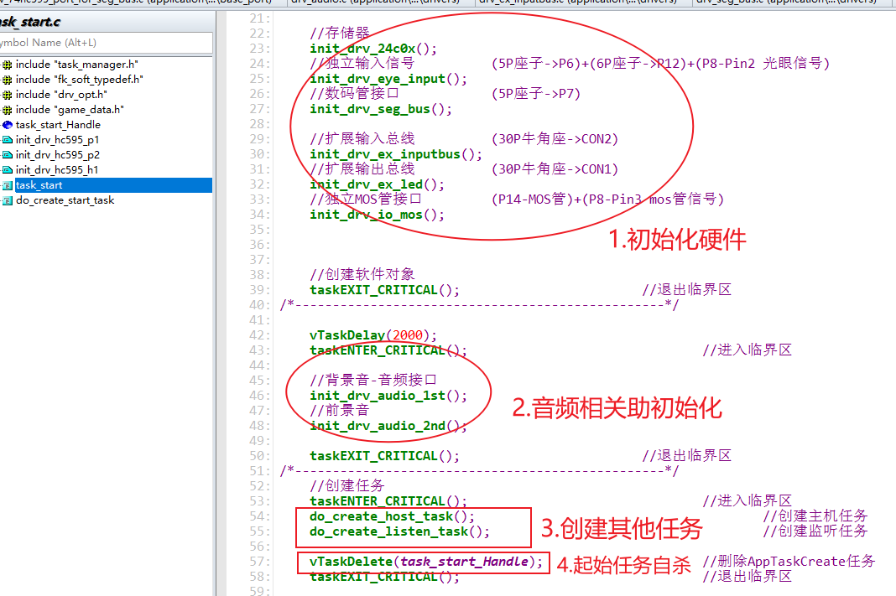
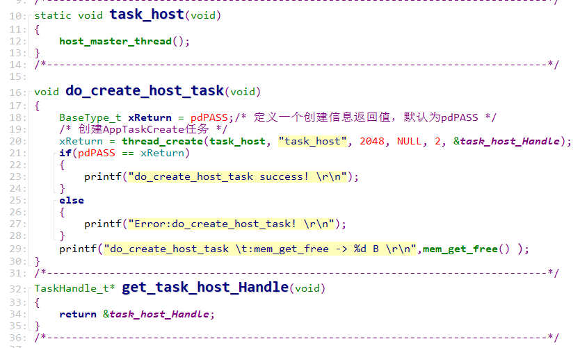
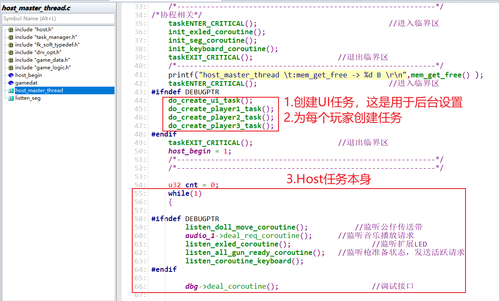
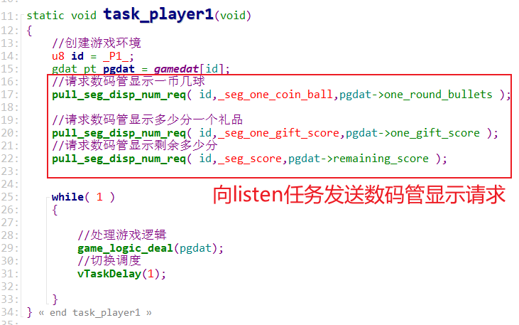
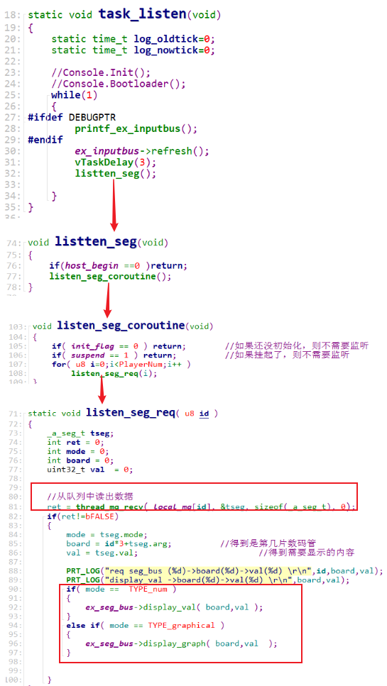
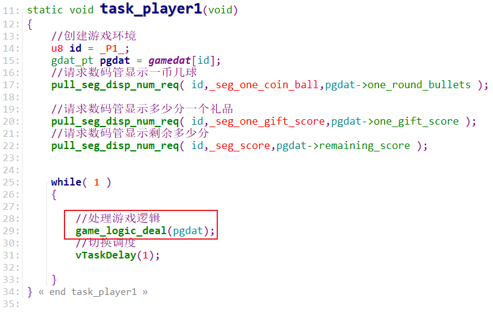
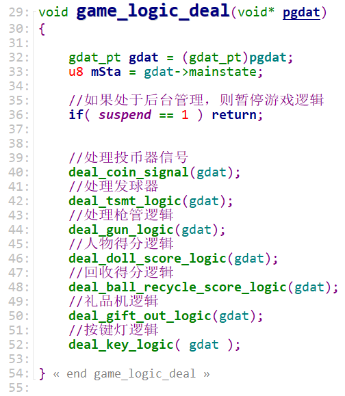

## 20211117\_讲解实际项目\_3人射球机

### 1. 需求与实现

#### 1.1 设计需求

#### 1.2 程序的多任务框架

#### 1.3 设计思想

* 对于模块，使用面向对象的思想编写程序，比如：
  * AT24C02
  * 数码管
  * 按键
* 

### 2. main函数

### 3. 起始任务

#### 3.1 创建host任务

用于管理：

传送带、音乐、激活状态等，

不是玩家独占的，

所以使用一个host任务来处理

#### 3.2 创建listen任务

每个玩家都有3个数码管，

但是这9个数码管都是使用同一条SPI总线控制，

所以：

使用一个listen任务来管理数码管，

它还可以更新玩家的按键

### 4. 主机任务

#### 4.1 创建

#### 4.2 功能

### 5. Listen任务

每个玩家都有3个数码管，

但是这9个数码管都是使用同一条SPI总线控制，

所以：

使用一个listen任务来管理数码管，

它还可以更新玩家的按键。

#### 5.1 数码管显示

##### 5.1.1 发送显示请求

以player1任务为例：

##### 5.1.2 操作数码管

listen任务从队列得到请求，显示数码管：

### 6. 玩家任务

#### 6.1 代码展示

#### 6.2 游戏逻辑

里面处理投币、发球器等，都是使用状态机轮询处理。

### 7. UI任务

这是用于后台管理，比如：

* 设置一个币出多少个球
* 多少分得到礼物

