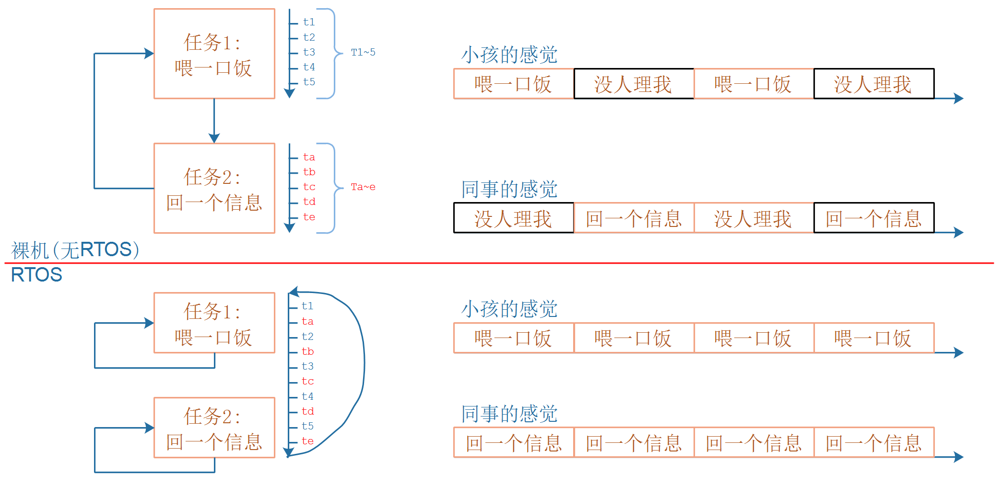
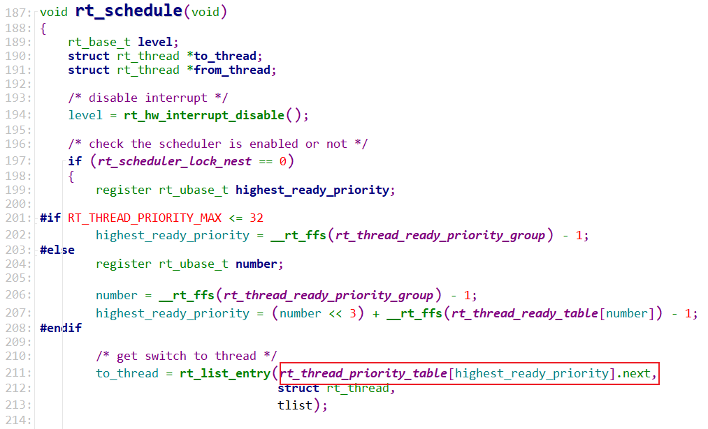

# RT-Thread完全开发手册之内部机制

## 资料下载


## 课程介绍

对于 RT-Thread 的掌握可以分为 3 个层次：

* 第 1 层：知道怎么使用相关 API 函数
* 第 2 层：知道内部机制
* 第 3 层：掌握代码实现的细节，能够移植

百问网科技在嵌入式操作系统领域深耕 13 年，能够使用 2 天(每天 6 小时)让你达到第 2 层。
这让你能够在日常开发中使用 RT-Thread 并解决疑难问题。
12 月 18 号 RT-Thread 开发者大会即将在深圳举行，作为 RT-Thread 的合作伙伴，我们将在12月11号全天举行一场技术直播，讲解 RT-Thread 的内部机制。

RT-Thread 的线程管理与调度、线程间通信(邮箱/消息队列/信号)、线程间同步(信号量/互  斥量/事件集)的方法，核心都是：

* 链表
* 定时器

基于链表和定时器，可以快速而深入地理解RT-Thread 。


## 1. RTOS 概念及线程的引入

### 1.1 RTOS的概念

#### 1.1.1 用人来类比单片机程序和RTOS


妈妈要一边给小孩喂饭，一边加班跟同事微信交流，怎么办？

对于单线条的人，不能分心、不能同时做事，她只能这样做：

* 给小孩喂一口饭
* 瞄一眼电脑，有信息就去回复
* 再回来给小孩喂一口饭
* 如果小孩吃这口饭太慢，她回复同事的信息也就慢了，被同事催：你半天都不回我？
* 如果回复同事的信息要写一大堆，小孩就着急得大哭起来。

这种做法，在软件开发上就是一般的单片机开发，没有用操作系统。


对于眼明手快的人，她可以一心多用，她这样做：

* 左手拿勺子，给小孩喂饭
* 右手敲键盘，回复同事
* 两不耽误，小孩“以为”妈妈在专心喂饭，同事“以为”她在专心聊天
* 但是脑子只有一个啊，虽然说“一心多用”，但是谁能同时思考两件事？
* 只是她反应快，上一秒钟在考虑夹哪个菜给小孩，下一秒钟考虑给同事回复什么信息

 

这种做法，在软件开发上就是使用操作系统，在单片机里叫做使用RTOS。

RTOS的意思是：Real-time operating system，实时操作系统。

我们使用的Windows也是操作系统，被称为通用操作系统。使用Windows时，我们经常碰到程序卡死、停顿的现象，日常生活中这可以忍受。

但是在电梯系统中，你按住开门键时如果没有即刻反应，即使只是慢个1秒，也会夹住人。

在专用的电子设备中，“实时性”很重要。


#### 1.1.2 程序简单示例

```c
// 经典单片机程序
void main()
{
	while (1)
    {
        喂一口饭();
        回一个信息();
    }
}
------------------------------------------------------
// RTOS程序    
int a;    
喂饭() 栈A
{
    int b = 2;
    int c;
    c = b+2;==> 1. b+2,  2. c = new val
    ---------------> 切换
    while (1)
    {
        喂一口饭();
    }
}

回信息()  栈B
{
    int b;
    while (1)
    {
        回一个信息();
    }
}

void main()
{
    create_task(喂饭);
    create_task(回信息);
    start_scheduler();
    while (1)
    {
        sleep();
    }
}
```





#### 1.1.3 提出问题

什么叫线程？回答这个问题之前，先想想怎么切换线程？怎么保存线程？

* 线程是函数吗？函数需要保存吗？函数在Flash上，不会被破坏，无需保存
* 函数执行到了哪里？需要保存吗？需要保存
* 函数里用到了全局变量，全局变量需要保存吗？全局变量在内存上，还能保存到哪里去？全局变量无需保存
* 函数里用到了局部变量，局部变量需要保存吗？局部变量在栈里，也是在内存里，只要避免栈不被破坏即可，局部变量无需保存
* 运算的中间值需要保存吗？中间值保存在哪里？在CPU寄存器里，另一个线程也要用到CPU寄存器，所以CPU寄存器需要保存
* 函数运行了哪里：它也是一个CPU寄存器，名为"PC"
* 汇总：CPU寄存器需要保存！
* 保存在哪里？保存在线程的栈里
* 怎么理解CPU寄存器、怎么理解栈？


### 1.2 ARM 架构及汇编

#### 1.2.1 ARM架构

ARM芯片属于精简指令集计算机(RISC：Reduced Instruction Set Computor)，它所用的指令比较简单，有如下特点：

① 对内存只有读、写指令

② 对于数据的运算是在CPU内部实现

③ 使用RISC指令的CPU复杂度小一点，易于设计

比如对于a=a+b这样的算式，需要经过下面4个步骤才可以实现：


细看这几个步骤，有些疑问：

① 读a，那么a的值读出来后保存在CPU里面哪里？

② 读b，那么b的值读出来后保存在CPU里面哪里？

③ a+b的结果又保存在哪里？

我们需要深入ARM处理器的内部。简单概括如下，我们先忽略各种CPU模式(系统模式、用户模式等等)。


CPU运行时，先去取得指令，再执行指令：

① 把内存a的值读入CPU寄存器R0

② 把内存b的值读入CPU寄存器R1

③ 把R0、R1累加，存入R0

④ 把R0的值写入内存a


CPU内部有r0到r15寄存器，这些寄存器有别名(下图来自[百度文库](https://wenku.baidu.com/view/2e9d9c7e941ea76e58fa04ef.html))：


#### 1.2.2 几条汇编指令

需要我们掌握的汇编指令并不多，只有几条：

* 读内存指令：LDR，即Load之意
* 写内存指令：STR，即Store之意
* 加减指令：ADD、SUB
* 跳转：BL，即Branch And Link
* 入栈指令：PUSH
* 出栈指令：POP


视频演示。

汇编并不复杂：

> **加载/存储指令(LDR/STR)**
>
> - 加载指令LDR： `LDR r0,[addrA]`  意思是将地址addrA的内容加载(存放)到r0里面
> - 存储指令STR： `STR r0,[addrA]`  意思是将r0中的值存储到地址addrA上
>
> **加法运算指令(ADD)**
>
> - 加法运算指令(ADD)： `ADD r0,r1,r2`  意思为：r0=r1+r2
> - 减法运算指令(SUB)： `SUB r0,r1,r2`  意思为：r0=r1-r2
>
> **寄存器入栈/出栈指令(PUSH/POP)**
>
> - 寄存器入栈(PUSH)： `PUSH {r3，lr}`  意思是将寄存器r3和pc写入内存栈
>   * 本质是写内存STR指令，高标号寄存器写入高地址的栈里，低标号寄存器写入低地址的栈里
>   * lr即r14，写入地址为`sp-4`的内存，然后：sp=sp-4
>   * r3，写入地址为`sp-4`的内存，然后：sp=sp-4
> - 寄存器出栈指令(POP)： `POP {r3，pc}`  意思是取出内存栈的数据放入r3和pc中
>   * 本质是读内存LDR指令，高标号寄存器的内容来自高地址的栈，低标号寄存器的内容来自低地址的栈
>   * 读地址为`sp`的内存存入r3，然后：sp=sp+4
>   * 读地址为`sp`的内存存入pc，然后：sp=sp+4
>


### 1.3 函数运行的本质

如下是一个简单的程序，在配套源码的`01_arm_stack`。

主函数里调用函数`add_val()`：

```c
void add_val(int *pa, int *pb)
{
	volatile int tmp;
	
	tmp = *pa;
	tmp = tmp + *pb;
	*pa = tmp;
}


int main()
{
	int a = 1;
	int b = 2;
	
	add_val(&a, &b);

	return 0;
}
```


其中调用函数`add_val()`的汇编代码如下，我们加上了注释：

```c
1   /* enter */ 
2   PUSH     {r3,lr}         //进入函数，寄存器r3、lr的值，都存入内存的栈中(lr保存程序返回地址)
3  
4   /* tmp = *pa; */ 
5   LDR      r2,[r0,#0x00]   //将寄存器r0的值存放到r2，其中r0是函数的第一个参数值(ARM ATPCS规定)
6   STR      r2,[sp,#0x00]   //将寄存器r2的值存储到sp指向的内存
7 
8   /* tmp = tmp + *pb;  */
9   LDR      r2,[r1,#0x00]   //将寄存器r1的值存放到r2，其中r1是函数的第二个参数值(ARM ATPCS规定)
10  LDR      r3,[sp,#0x00]   //将寄存器sp指向内存的值存放到r3
11  ADD      r2,r2,r3        //将寄存器r2和r3相加，保存到r2
12  STR      r2,[sp,#0x00]   //将寄存器r2的值存储到sp指向的内存 
13 
14  /* *pa = tmp; */ 
15  LDR      r2,[sp,#0x00]   //将寄存器sp指向内存的值存放到r2
16  STR      r2,[r0,#0x00]   //将寄存器r2的值存储到r0，其中r0将作为函数返回值(ARM ATPCS规定)
17  
18  /* quit */
19  POP      {r3,pc}         //退出函数，获取内存的栈中的数据放入r3和pc中(此时pc为lr,实现了函数返回)
```


视频里动态演示，重点演示栈的使用。


### 1.4 什么叫线程？ 怎么保存线程？

现在可以回答这个问题了。

什么叫线程：运行中的函数、被暂停运行的函数

怎么保存线程：把暂停瞬间的CPU寄存器值，保存进栈里。


视频里动态演示：在函数的某个位置，怎么保存当前环境？


## 2. 创建线程的函数


### 2.1 参数解析

* 线程做什么？需要提供函数
* 线程随时会别切换，哪些寄存器保存在哪里？需要提供栈：可以实现分配(比如使用数组)，也可以动态分配
* 怎么记录这些信息：栈在哪里？需要有一个线程结构体


#### 2.1.1 线程结构体

rt_thread用来表示一个线程，它的重要成员如下：

* thread->entry：函数指针
* thread->parameter：函数参数
* thread->stack_addr：栈的起始地址
* thread->stack_size：栈大小
* thread->sp：栈顶
* thread->init_priority：初始优先级
* thread->current_priority：当前优先级
* thread->init_tick：一次能运行多少个tick
* thread->remaining_tick：当次运行还剩多少个tick

```c

/**
 * Thread structure
 */
struct rt_thread
{
    /* rt object */
    char        name[RT_NAME_MAX];                      /**< the name of thread */
    rt_uint8_t  type;                                   /**< type of object */
    rt_uint8_t  flags;                                  /**< thread's flags */

#ifdef RT_USING_MODULE
    void       *module_id;                              /**< id of application module */
#endif

    rt_list_t   list;                                   /**< the object list */
    rt_list_t   tlist;                                  /**< the thread list */

    /* stack point and entry */
    void       *sp;                                     /**< stack point */
    void       *entry;                                  /**< entry */
    void       *parameter;                              /**< parameter */
    void       *stack_addr;                             /**< stack address */
    rt_uint32_t stack_size;                             /**< stack size */

    /* error code */
    rt_err_t    error;                                  /**< error code */

    rt_uint8_t  stat;                                   /**< thread status */

    /* priority */
    rt_uint8_t  current_priority;                       /**< current priority */
    rt_uint8_t  init_priority;                          /**< initialized priority */
#if RT_THREAD_PRIORITY_MAX > 32
    rt_uint8_t  number;
    rt_uint8_t  high_mask;
#endif
    rt_uint32_t number_mask;

#if defined(RT_USING_EVENT)
    /* thread event */
    rt_uint32_t event_set;
    rt_uint8_t  event_info;
#endif

#if defined(RT_USING_SIGNALS)
    rt_sigset_t     sig_pending;                        /**< the pending signals */
    rt_sigset_t     sig_mask;                           /**< the mask bits of signal */

#ifndef RT_USING_SMP
    void            *sig_ret;                           /**< the return stack pointer from signal */
#endif
    rt_sighandler_t *sig_vectors;                       /**< vectors of signal handler */
    void            *si_list;                           /**< the signal infor list */
#endif

    rt_ubase_t  init_tick;                              /**< thread's initialized tick */
    rt_ubase_t  remaining_tick;                         /**< remaining tick */

    struct rt_timer thread_timer;                       /**< built-in thread timer */

    void (*cleanup)(struct rt_thread *tid);             /**< cleanup function when thread exit */

    /* light weight process if present */
#ifdef RT_USING_LWP
    void        *lwp;
#endif

    rt_uint32_t user_data;                             /**< private user data beyond this thread */
};
```


### 2.2 创建线程的过程

创建线程的过程，就是构造栈的过程。

函数调用关系如下：

```shell
rt_thread_create
		// 1. 分配线程结构体
	    thread = (struct rt_thread *)rt_object_allocate(RT_Object_Class_Thread,
                                                    name);
                                                    
		// 2. 分配栈
		stack_start = (void *)RT_KERNEL_MALLOC(stack_size);
		
		// 3. 初始化栈，即构造栈的内容
		_rt_thread_init
			// 3.1 具体操作
			thread->sp = (void *)rt_hw_stack_init

```

视频里分析这个函数：


## 3. 线程的调度机制(核心是链表与定时器)

### 3.1 使用链表来管理线程

有很多线程都想运行，优先级各不相同，怎么管理它们？

```c
rt_list_t rt_thread_priority_table[RT_THREAD_PRIORITY_MAX];
```

每个优先级，都有一个就绪链表：rt_thread_priority_table[优先级]，

线程被创建后，要使用`rt_thread_startup()`来启动它，调用过程为：

```c
rt_thread_startup
    rt_thread_resume(thread);
		rt_schedule_insert_thread(thread);
            /* insert thread to ready list */
            rt_list_insert_before(&(rt_thread_priority_table[thread->current_priority]),
                                  &(thread->tlist));			
```


### 3.2 使用链表来理解调度机制

#### 3.2.1 第1个线程是谁？

最高优先级的、ready list里的、第1个线程：


#### 3.2.2 抢占

最高优先级的、ready list里的、第1个线程：




### 3.3 使用链表和Tick来理解时间片轮转

FreeRTOS的任务轮转时：每个任务运行一个Tick。

RT-Thread的线程轮转时：每个线程可以运行指定的Tick(创建线程时指定了时间片)：


在线程结构体中会记录tick数值：它运行多少个Tick，才会让出CPU资源。

创建线程时，会调用到函数`_rt_thread_init()`，里面会设置Tick参数：

```c
    /* tick init */
    thread->init_tick      = tick;
    thread->remaining_tick = tick;
```

当前任务还可以运行多少个tick？在thread->remaining_tick中记录；

每发生一次tick中断，thread->remaining_tick减1；

当thread->remaining_tick等于0时，要让出CPU：调用`rt_thread_yield()`


`rt_thread_yield()`就是把当前、用完时间的线程，放到就绪链表的最后：


注意：

* 如果有更高优先级线程，即使当前线程是时间片没用完，也会立刻被抢占
* 当它被抢占后，再次运行时：继续运行完剩下的时间


### 3.5 线程状态的切换(链表+定时器)

参考程序：`RT-Thread_06_taskdelay`

#### 3.5.1 线程状态切换图


#### 3.5.2 核心：链表和定时器

每个线程内部都有一个定时器，它的作用非常大：所有的超时函数都依赖它。

```c
struct rt_thread
{
    ......
    struct rt_timer thread_timer;                       /**< built-in thread timer */
    ......
}
```


以`rt_thread_mdelay(50)`为例，它会让当前线程挂起50ms，会先把50ms转换为Tick个数。

也可以使用`rt_thread_delay(50)`，它会让当前线程挂起50个Tick。

挂起过程：

* 把当前线程从就绪链表中取出来
* 设定定时器：
  * 在创建线程时已经设置了超时函数
    
  * thread_timer->timeout_tick = rt_tick_get() + timer->init_tick;  // 当前Tick加上某个数值
  * 把定时器放入链表: rt_timer_list[xxx]
* 切换线程：rt_schedule

被唤醒过程：

* 系统每隔一定时间产生Tick中断，Tick中断函数会调用`rt_tick_increase()`
  

* rt_timer_check功能

  * 检查rt_timer_list[xxx]链表，找出超时的定时器，把它从链表中移除

  * 调用定时器的超时函数：`t->timeout_func(t->parameter);`，对于线程自带的定时器，这个函数就是`rt_thread_timeout`

    


## 4. 消息队列(queue)


### 4.1 核心是：链表和定时器

有两个链表：

* 写队列不成功而挂起
* 读队列不成功而挂起


### 4.2 操作示例

参考程序：`RT-Thread_08_queue`

#### 4.2.1 写队列

调用过程：

```c
rt_mq_send_wait
        /* 如果不成功：当前线程挂起, 并放入链表: mq->suspend_sender_thread */
        rt_ipc_list_suspend(&(mq->suspend_sender_thread),
                            thread,
                            mq->parent.parent.flag);

		/* 如果指定了超时时间: 最多等多久 
		 * 设置、启动线程定时器
		 */
		rt_timer_start(&(thread->thread_timer));
    
```


一个线程写队列时，如果队列已经满了，它会被挂起，何时被唤醒？

* 超时：注意thread->errro等于"-RT_ETIMEOUT"
  
* 别的线程读队列: 注意thread->errro等于默认值
  

