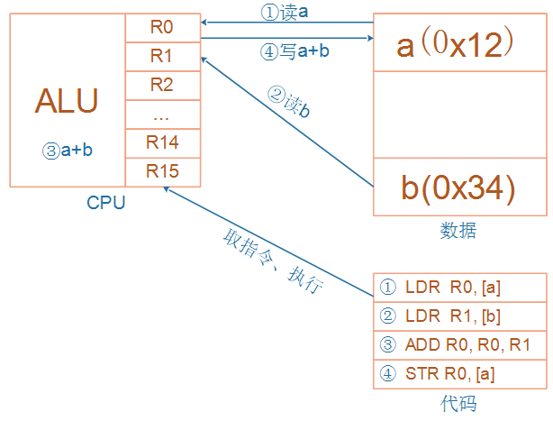
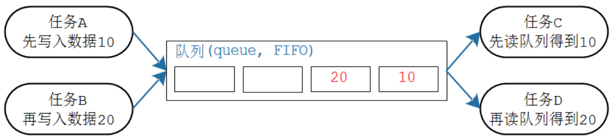
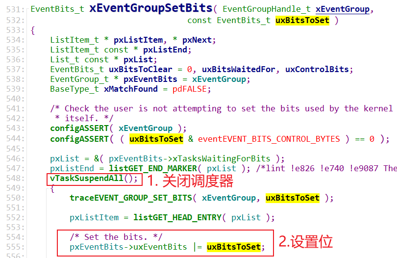

# FreeRTOS完全开发手册之内部机制

## 资料下载


## 课程介绍

对于 FreeRTOS 的掌握可以分为 3 个层次：

* 第 1 层：知道怎么使用相关 API 函数
* 第 2 层：知道内部机制
* 第 3 层：掌握代码实现的细节，能够移植

百问网科技在嵌入式操作系统领域深耕 13 年，能够使用 2 天(每天 6 小时)让你达到第 2 层。
这让你能够在日常开发中使用 FreeRTOS 并解决疑难问题。

FreeRTOS的任务管理与调度、任务间通信(消息队列)、任务间同步(信号量/互斥量/事件集)的方法，核心都是：

* 链表

基于链表，可以快速而深入地理解FreeRTOS 。


## 1. RTOS 概念及任务的引入

### 1.1 RTOS的概念

#### 1.1.1 用人来类比单片机程序和RTOS


妈妈要一边给小孩喂饭，一边加班跟同事微信交流，怎么办？

对于单线条的人，不能分心、不能同时做事，她只能这样做：

* 给小孩喂一口饭
* 瞄一眼电脑，有信息就去回复
* 再回来给小孩喂一口饭
* 如果小孩吃这口饭太慢，她回复同事的信息也就慢了，被同事催：你半天都不回我？
* 如果回复同事的信息要写一大堆，小孩就着急得大哭起来。

这种做法，在软件开发上就是一般的单片机开发，没有用操作系统。


对于眼明手快的人，她可以一心多用，她这样做：

* 左手拿勺子，给小孩喂饭
* 右手敲键盘，回复同事
* 两不耽误，小孩“以为”妈妈在专心喂饭，同事“以为”她在专心聊天
* 但是脑子只有一个啊，虽然说“一心多用”，但是谁能同时思考两件事？
* 只是她反应快，上一秒钟在考虑夹哪个菜给小孩，下一秒钟考虑给同事回复什么信息

 

这种做法，在软件开发上就是使用操作系统，在单片机里叫做使用RTOS。

RTOS的意思是：Real-time operating system，实时操作系统。

我们使用的Windows也是操作系统，被称为通用操作系统。使用Windows时，我们经常碰到程序卡死、停顿的现象，日常生活中这可以忍受。

但是在电梯系统中，你按住开门键时如果没有即刻反应，即使只是慢个1秒，也会夹住人。

在专用的电子设备中，“实时性”很重要。


#### 1.1.2 程序简单示例

```c
// 经典单片机程序
void main()
{
	while (1)
    {
        喂一口饭();
        回一个信息();
    }
}
------------------------------------------------------
// RTOS程序    
int a;    
喂饭() 栈A
{
    int b = 2;
    int c;
    c = b+2;==> 1. b+2,  2. c = new val
    ---------------> 切换
    while (1)
    {
        喂一口饭();
    }
}

回信息()  栈B
{
    int b;
    while (1)
    {
        回一个信息();
    }
}

void main()
{
    create_task(喂饭);
    create_task(回信息);
    start_scheduler();
    while (1)
    {
        sleep();
    }
}
```


#### 1.1.3 提出问题

什么叫任务？回答这个问题之前，先想想怎么切换任务？怎么保存任务？

* 任务是函数吗？函数需要保存吗？函数在Flash上，不会被破坏，无需保存
* 函数执行到了哪里？需要保存吗？需要保存
* 函数里用到了全局变量，全局变量需要保存吗？全局变量在内存上，还能保存到哪里去？全局变量无需保存
* 函数里用到了局部变量，局部变量需要保存吗？局部变量在栈里，也是在内存里，只要避免栈不被破坏即可，局部变量无需保存
* 运算的中间值需要保存吗？中间值保存在哪里？在CPU寄存器里，另一个任务也要用到CPU寄存器，所以CPU寄存器需要保存
* 函数运行了哪里：它也是一个CPU寄存器，名为"PC"
* 汇总：CPU寄存器需要保存！
* 保存在哪里？保存在任务的栈里
* 怎么理解CPU寄存器、怎么理解栈？


### 1.2 ARM 架构及汇编

#### 1.2.1 ARM架构

ARM芯片属于精简指令集计算机(RISC：Reduced Instruction Set Computor)，它所用的指令比较简单，有如下特点：

① 对内存只有读、写指令

② 对于数据的运算是在CPU内部实现

③ 使用RISC指令的CPU复杂度小一点，易于设计

比如对于a=a+b这样的算式，需要经过下面4个步骤才可以实现：


细看这几个步骤，有些疑问：

① 读a，那么a的值读出来后保存在CPU里面哪里？

② 读b，那么b的值读出来后保存在CPU里面哪里？

③ a+b的结果又保存在哪里？

我们需要深入ARM处理器的内部。简单概括如下，我们先忽略各种CPU模式(系统模式、用户模式等等)。



CPU运行时，先去取得指令，再执行指令：

① 把内存a的值读入CPU寄存器R0

② 把内存b的值读入CPU寄存器R1

③ 把R0、R1累加，存入R0

④ 把R0的值写入内存a


CPU内部有r0到r15寄存器，这些寄存器有别名(下图来自[百度文库](https://wenku.baidu.com/view/2e9d9c7e941ea76e58fa04ef.html))：


#### 1.2.2 几条汇编指令

需要我们掌握的汇编指令并不多，只有几条：

* 读内存指令：LDR，即Load之意
* 写内存指令：STR，即Store之意
* 加减指令：ADD、SUB
* 跳转：BL，即Branch And Link
* 入栈指令：PUSH
* 出栈指令：POP


视频演示。

汇编并不复杂：

> **加载/存储指令(LDR/STR)**
>
> - 加载指令LDR： `LDR r0,[addrA]`  意思是将地址addrA的内容加载(存放)到r0里面
> - 存储指令STR： `STR r0,[addrA]`  意思是将r0中的值存储到地址addrA上
>
> **加法运算指令(ADD)**
>
> - 加法运算指令(ADD)： `ADD r0,r1,r2`  意思为：r0=r1+r2
> - 减法运算指令(SUB)： `SUB r0,r1,r2`  意思为：r0=r1-r2
>
> **寄存器入栈/出栈指令(PUSH/POP)**
>
> - 寄存器入栈(PUSH)： `PUSH {r3，lr}`  意思是将寄存器r3和pc写入内存栈
>   * 本质是写内存STR指令，高标号寄存器写入高地址的栈里，低标号寄存器写入低地址的栈里
>   * lr即r14，写入地址为`sp-4`的内存，然后：sp=sp-4
>   * r3，写入地址为`sp-4`的内存，然后：sp=sp-4
> - 寄存器出栈指令(POP)： `POP {r3，pc}`  意思是取出内存栈的数据放入r3和pc中
>   * 本质是读内存LDR指令，高标号寄存器的内容来自高地址的栈，低标号寄存器的内容来自低地址的栈
>   * 读地址为`sp`的内存存入r3，然后：sp=sp+4
>   * 读地址为`sp`的内存存入pc，然后：sp=sp+4
>


### 1.3 函数运行的本质

如下是一个简单的程序，在配套源码的`01_arm_stack`。

主函数里调用函数`add_val()`：

```c
void add_val(int *pa, int *pb)
{
	volatile int tmp;
	
	tmp = *pa;
	tmp = tmp + *pb;
	*pa = tmp;
}


int main()
{
	int a = 1;
	int b = 2;
	
	add_val(&a, &b);

	return 0;
}
```


其中调用函数`add_val()`的汇编代码如下，我们加上了注释：

```c
1   /* enter */ 
2   PUSH     {r3,lr}         //进入函数，寄存器r3、lr的值，都存入内存的栈中(lr保存程序返回地址)
3  
4   /* tmp = *pa; */ 
5   LDR      r2,[r0,#0x00]   //将寄存器r0的值存放到r2，其中r0是函数的第一个参数值(ARM ATPCS规定)
6   STR      r2,[sp,#0x00]   //将寄存器r2的值存储到sp指向的内存
7 
8   /* tmp = tmp + *pb;  */
9   LDR      r2,[r1,#0x00]   //将寄存器r1的值存放到r2，其中r1是函数的第二个参数值(ARM ATPCS规定)
10  LDR      r3,[sp,#0x00]   //将寄存器sp指向内存的值存放到r3
11  ADD      r2,r2,r3        //将寄存器r2和r3相加，保存到r2
12  STR      r2,[sp,#0x00]   //将寄存器r2的值存储到sp指向的内存 
13 
14  /* *pa = tmp; */ 
15  LDR      r2,[sp,#0x00]   //将寄存器sp指向内存的值存放到r2
16  STR      r2,[r0,#0x00]   //将寄存器r2的值存储到r0，其中r0将作为函数返回值(ARM ATPCS规定)
17  
18  /* quit */
19  POP      {r3,pc}         //退出函数，获取内存的栈中的数据放入r3和pc中(此时pc为lr,实现了函数返回)
```


视频里动态演示，重点演示栈的使用。


### 1.4 什么叫任务？ 怎么保存任务？

现在可以回答这个问题了。

什么叫任务：运行中的函数、被暂停运行的函数

怎么保存任务：把暂停瞬间的CPU寄存器值，保存进栈里。


视频里动态演示：在函数的某个位置，怎么保存当前环境？


## 2. 创建任务的函数


### 2.1 参数解析

* 任务做什么？需要提供函数
* 任务随时会别切换，哪些寄存器保存在哪里？需要提供栈：可以实现分配(比如使用数组)，也可以动态分配
* 怎么记录这些信息：栈在哪里？需要有一个任务结构体


#### 2.1.1 任务结构体

TCB_t用来表示一个任务，它的重要成员如下：

* pxTopOfStack：执行栈里的最后一个元素
* xStateListItem：通过它把当前任务放入某个状态链表(Ready, Blocked, Suspended)
* xEventListItem：比如任务在等待队列A，则通过xEventListItem把自己放入队列A的链表
* uxPriority：任务的原始优先级
* pxStack：栈的起始位置
* pxEndOfStack：栈顶，栈的最高的、有效地址
* uxBasePriority：任务的当前优先级

提问：在TCB_t里怎么没看到函数指针？初始化任务时，把函数指针存入了栈里。

```c
typedef struct tskTaskControlBlock       /* The old naming convention is used to prevent breaking kernel aware debuggers. */
{
    volatile StackType_t * pxTopOfStack; /*< Points to the location of the last item placed on the tasks stack.  THIS MUST BE THE FIRST MEMBER OF THE TCB STRUCT. */

    #if ( portUSING_MPU_WRAPPERS == 1 )
        xMPU_SETTINGS xMPUSettings; /*< The MPU settings are defined as part of the port layer.  THIS MUST BE THE SECOND MEMBER OF THE TCB STRUCT. */
    #endif

    ListItem_t xStateListItem;                  /*< The list that the state list item of a task is reference from denotes the state of that task (Ready, Blocked, Suspended ). */
    ListItem_t xEventListItem;                  /*< Used to reference a task from an event list. */
    UBaseType_t uxPriority;                     /*< The priority of the task.  0 is the lowest priority. */
    StackType_t * pxStack;                      /*< Points to the start of the stack. */
    char pcTaskName[ configMAX_TASK_NAME_LEN ]; /*< Descriptive name given to the task when created.  Facilitates debugging only. */ /*lint !e971 Unqualified char types are allowed for strings and single characters only. */

    #if ( ( portSTACK_GROWTH > 0 ) || ( configRECORD_STACK_HIGH_ADDRESS == 1 ) )
        StackType_t * pxEndOfStack; /*< Points to the highest valid address for the stack. */
    #endif

    #if ( portCRITICAL_NESTING_IN_TCB == 1 )
        UBaseType_t uxCriticalNesting; /*< Holds the critical section nesting depth for ports that do not maintain their own count in the port layer. */
    #endif

    #if ( configUSE_TRACE_FACILITY == 1 )
        UBaseType_t uxTCBNumber;  /*< Stores a number that increments each time a TCB is created.  It allows debuggers to determine when a task has been deleted and then recreated. */
        UBaseType_t uxTaskNumber; /*< Stores a number specifically for use by third party trace code. */
    #endif

    #if ( configUSE_MUTEXES == 1 )
        UBaseType_t uxBasePriority; /*< The priority last assigned to the task - used by the priority inheritance mechanism. */
        UBaseType_t uxMutexesHeld;
    #endif

    #if ( configUSE_APPLICATION_TASK_TAG == 1 )
        TaskHookFunction_t pxTaskTag;
    #endif

    #if ( configNUM_THREAD_LOCAL_STORAGE_POINTERS > 0 )
        void * pvThreadLocalStoragePointers[ configNUM_THREAD_LOCAL_STORAGE_POINTERS ];
    #endif

    #if ( configGENERATE_RUN_TIME_STATS == 1 )
        uint32_t ulRunTimeCounter; /*< Stores the amount of time the task has spent in the Running state. */
    #endif

    #if ( configUSE_NEWLIB_REENTRANT == 1 )
        /* Allocate a Newlib reent structure that is specific to this task.
         * Note Newlib support has been included by popular demand, but is not
         * used by the FreeRTOS maintainers themselves.  FreeRTOS is not
         * responsible for resulting newlib operation.  User must be familiar with
         * newlib and must provide system-wide implementations of the necessary
         * stubs. Be warned that (at the time of writing) the current newlib design
         * implements a system-wide malloc() that must be provided with locks.
         *
         * See the third party link http://www.nadler.com/embedded/newlibAndFreeRTOS.html
         * for additional information. */
        struct  _reent xNewLib_reent;
    #endif

    #if ( configUSE_TASK_NOTIFICATIONS == 1 )
        volatile uint32_t ulNotifiedValue[ configTASK_NOTIFICATION_ARRAY_ENTRIES ];
        volatile uint8_t ucNotifyState[ configTASK_NOTIFICATION_ARRAY_ENTRIES ];
    #endif

    /* See the comments in FreeRTOS.h with the definition of
     * tskSTATIC_AND_DYNAMIC_ALLOCATION_POSSIBLE. */
    #if ( tskSTATIC_AND_DYNAMIC_ALLOCATION_POSSIBLE != 0 ) /*lint !e731 !e9029 Macro has been consolidated for readability reasons. */
        uint8_t ucStaticallyAllocated;                     /*< Set to pdTRUE if the task is a statically allocated to ensure no attempt is made to free the memory. */
    #endif

    #if ( INCLUDE_xTaskAbortDelay == 1 )
        uint8_t ucDelayAborted;
    #endif

    #if ( configUSE_POSIX_ERRNO == 1 )
        int iTaskErrno;
    #endif
} tskTCB;
```


### 2.2 创建任务的过程

创建任务的过程，就是构造栈的过程。

函数调用关系如下：

```shell
xTaskCreate
		// 1. 分配任务结构体
	    TCB_t * pxNewTCB;
	    pxNewTCB = ( TCB_t * ) pvPortMalloc( sizeof( TCB_t ) );
                                                    
		// 2. 分配栈
		pxNewTCB->pxStack = ( StackType_t * ) pvPortMallocStack( ... );
		
		// 3. 初始化任务栈，即构造TCB_t的内容
		prvInitialiseNewTask
			// 3.1 初始化优先级、队列等等
			pxNewTCB->uxPriority = uxPriority;
			vListInitialiseItem( &( pxNewTCB->xStateListItem ) );
			vListInitialiseItem( &( pxNewTCB->xEventListItem ) );
			
			// 3.2 初始化栈
			pxNewTCB->pxTopOfStack = pxPortInitialiseStack(...)
		
		// 4. 放入就绪链表
		prvAddNewTaskToReadyList( pxNewTCB );
```


## 3. 任务的调度机制(核心是链表)

### 3.1 使用链表来管理任务

有很多任务都想运行，优先级各不相同，怎么管理它们？


每个优先级，都有一个就绪链表：pxReadyTasksLists[优先级]，

任务被创建时，要使用`prvAddNewTaskToReadyList()`来把它放入对应的就绪链表，调用过程为：

```c
xTaskCreate
    prvAddNewTaskToReadyList
    	listINSERT_END( &( pxReadyTasksLists[ ( pxTCB )->uxPriority ] ), &( ( pxTCB )->xStateListItem ) );
```


### 3.2 使用链表来理解调度机制

#### 3.2.1 第1个任务是谁？

最高优先级的ready list里最后一个创建的任务：


#### 3.2.2 抢占

最高优先级的ready list里的第1个任务永远可以即刻执行：


### 3.3 使用链表和Tick来理解时间片轮转

FreeRTOS的任务轮转时：每个任务运行一个Tick。


### 3.5 任务状态的切换(链表+Tick)

参考程序：`FreeRTOS_06_taskdelay`

#### 3.5.1 任务状态切换图


#### 3.5.2 核心：链表


## 4. 消息队列(queue)




### 4.1 核心是：关中断、环形缓冲区、链表

#### 4.1.1 怎么互斥访问数据

简单粗暴：关中断

示例：`FreeRTOS_08_queue`


#### 4.1.2 怎么传递数据

使用环形缓冲区传递数据。

视频里讲解。


#### 4.1.3 怎么休眠/唤醒

有两个链表：

* 写队列不成功而挂起
* 读队列不成功而挂起


### 4.2 操作示例

参考程序：`FreeRTOS_08_queue`

#### 4.2.1 写队列

调用过程：

```c
xQueueSendToBack
    xQueueGenericSend
        /* 如果不成功: */
        vTaskPlaceOnEventList( &( pxQueue->xTasksWaitingToSend ), xTicksToWait );
			// 1. 当前任务记录在队列的链表里:  pxQueue->xTasksWaitingToSend
			vListInsert( pxEventList, &( pxCurrentTCB->xEventListItem ) );

			// 2. 把当前任务从ready list放到delayed list
			prvAddCurrentTaskToDelayedList( xTicksToWait, pdTRUE );
```


一个任务写队列时，如果队列已经满了，它会被挂起，何时被唤醒？

* 超时：
  * 任务写队列不成功时，它会被挂起：从ready list移到delayed list中
  * 在delayed list中，按照"超时时间"排序
  * 系统Tick中断不断发生，在Tick中断里判断delayed list中的任务时间到没？时间到后就唤醒它
    


* 别的任务读队列:
  


## 5. 信号量(semaphore)


信号量就是特殊的队列。

队列里使用环形缓冲区存放数据，

信号量里只记录计数值。


## 6. 互斥量(mutex)


互斥量就是特殊的队列。

互斥量更是特殊的信号量，

互斥量实现了优先级继承。


## 7. 事件组(event group)

示例程序：`FreeRTOS_20_event_group_wait_multi_events`

学校组织秋游，组长在等待：

* 张三：我到了
* 李四：我到了
* 王五：我到了
* 组长说：好，大家都到齐了，出发！

秋游回来第二天就要提交一篇心得报告，组长在焦急等待：张三、李四、王五谁先写好就交谁的。

在这个日常生活场景中：

* 出发：要等待这3个人都到齐，他们是"与"的关系
* 交报告：只需等待这3人中的任何一个，他们是"或"的关系

在FreeRTOS中，可以使用事件组(event group)来解决这些问题。


### 7.1 核心是：关调度器、位操作、链表


#### 7.1.1 怎么互斥访问数据

简单粗暴：关调度器

示例：`FreeRTOS_20_event_group_wait_multi_events`


#### 7.1.2 位操作

* 设置位：
  


* 等待位
  


#### 7.1.3 链表

* 设置位后，会唤醒"所有符合条件"的任务
  
* 等待位的时候，条件不满足则会休眠
  


### 7.2 示例代码

示例程序：`FreeRTOS_20_event_group_wait_multi_events`


## 8. 任务通知(Task Notification)

示例程序：`FreeRTOS_23_tasknotify_tansfer_value`


使用队列、信号量、互斥量、事件组等机制时，步骤都是这样的：

* 创建对象
* 写/Give
* 读/Take


对于任务通知，不需要"创建对象"，因为要操作的对象就在TCB里：


### 8.1 核心: 通知状态、通知值

#### 8.1.1 通知状态

一个任务的"通知状态"有三种：

* taskNOT_WAITING_NOTIFICATION：任务没有在等待通知
* taskWAITING_NOTIFICATION：任务在等待通知
* taskNOTIFICATION_RECEIVED：任务接收到了通知，也被称为 pending(有数据了，待处理)  


一个任务想等待别人发来通知，可以调用`ulTaskNotifyTake  `或`xTaskNotifyWait  `：

* 可能别人早就发来通知："通知状态"为taskNOTIFICATION_RECEIVED，那么函数立刻返回
* 可能别人还没发来通知：这些函数把"通知状态"从taskNOT_WAITING_NOTIFICATION改为taskWAITING_NOTIFICATION，然后休眠


别的任务可以使用`xTaskNotifyGive`或`xTaskNotify `给某个任务发通知：

* 会马上唤醒对方
* 无条件唤醒对方，不管对方期待什么数据


#### 8.1.2 通知值

只是一个整数，调用`xTaskNotifyGive`或`xTaskNotify `时，传入不同的参数，可以去设置这个数值：

* 不改变它的数值，只想唤醒任务
* 增加1
* 设置为某个数


### 8.2 代码分析


## 9. 定时器


## 10. 中断

### 10.1 两套API


### 10.2 两类中断


### 10.3 优先级


## 11. 临界资源访问方法

```c
taskENTER_CRITICAL();

/* 可以避免其他任务、ISR来破坏 */

taskEXIT_CRITICAL();

-----------------------------------------

vTaskSuspendAll();

/* 可以避免其他任务来破坏 */

( void ) xTaskResumeAll();
```


