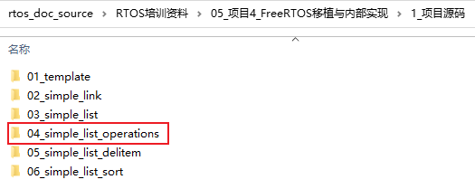
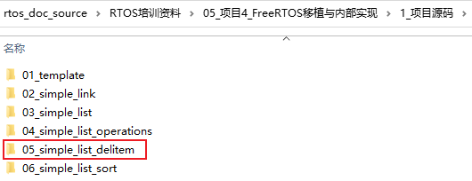
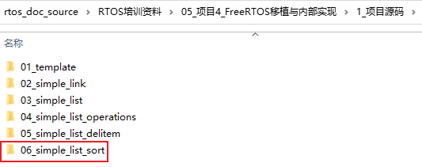

## 普通的链表插入删除排序操作

### 1. 创建链表

参考源码：



```c
struct list {
	char *name; /* A班 */
	struct person *next;
};

void InitList(struct list *pList, char *name)
{
	pList->name = name;
	pList->next = NULL;
}
```


### 2. 插入链表

参考源码：


```c
void AddItemToList(struct list *pList, struct person *new_persion)
{
	struct person *last;
	
	/* 如果是空链表 */
	if (pList->next == NULL)
	{
		pList->next = new_persion;
		new_persion->next =NULL;
		return;
	}
	
	last = pList->next;
	while (last->next)
	{
		last = last->next;
	}
	
	/* last->next == NULL */
	last->next = new_persion;
	new_persion->next =NULL;
}
```


### 3. 链表中删除项

参考源码：



```c
void DelItemFromList(struct list *pList, struct person *person)
{
	struct person *p = pList->next;
	struct person *pre = NULL;
	
	/* 找到person */
	while (p != NULL && p != person)
	{
		/* 后面还有人, 移动到下一个 */
		pre = p;
		p = p->next;
	}
	
	/* 退出的条件: p==NULL, p == person */
	if (p == NULL)
	{
		printf("can not find the person to del\r\n");
		return;
	}
	
	if (pre == NULL) /* 前面无人, 表示要删除的是第1项 */
	{
		pList->next = p->next;
	}
	else
	{
		pre->next = p->next;
	}	
}
```


### 4. 排序

参考源码：



```c
void SortList(struct list *pList)
{
	struct person *pre;
	struct person *next;
	
	char *tmp_name;
	int tmp_age;
	
	pre = pList->next;
	if (pre == NULL)
		return;
	
	while (pre)
	{
		next = pre->next;
		while (next)
		{
			if (pre->age > next->age)
			{
				/* 交换值 */
				tmp_name = pre->name;
				pre->name = next->name;
				next->name = tmp_name;

				tmp_age = pre->age;
				pre->age = next->age;
				next->age = tmp_age;
			}
			
			next = next->next;
		}
		
		pre = pre->next;
	}
	
}
```

