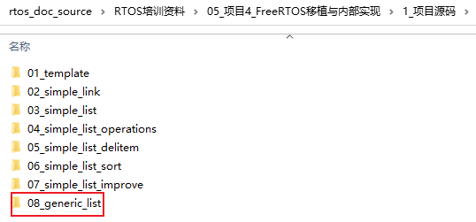

## 通用链表

本节课程代码：




### 1. 链表结构体

```c
struct node_t {
	struct node_t *next;
};

struct person {
	char *name;
	int age;
	struct node_t node;
};

struct list {
	char *name; /* A班 */
	struct node_t head;
};
```


### 2. 创建链表

```c
void InitList(struct list *pList, char *name)
{
	pList->name = name;
	pList->head.next = NULL;
}
```


### 3. 插入链表

```c
void AddItemToList(struct list *pList, struct node_t *new_node)
{
	struct node_t *last = &pList->head;
	
	while (last->next)
	{
		last = last->next;
	}
	
	/* last->next == NULL */
	last->next = new_node;
	new_node->next =NULL;
}

void AddItemAfter(struct node_t *pre, struct node_t *new_node)
{
	new_node->next = pre->next;
	pre->next = new_node;
}
```


### 4. 链表中删除项

```c
void DelItemFromList(struct list *pList, struct node_t *node)
{
	struct node_t *pre = &pList->head;
	
	/* 找到node */
	while (pre != NULL && pre->next != node)
	{
		pre = pre->next;
	}
	
	/* 没找到 */
	if (pre == NULL)
		return;
	else
		pre->next = node->next;
}
```


### 5. 排序

```c
int CmpPersonAge(struct node_t *pre, struct node_t *next)
{
	struct person *p;
	struct person *n;
	
	p = (struct person *)((char *)pre - (unsigned int)&((struct person *)0)->node);
	n = (struct person *)((char *)next - (unsigned int)&((struct person *)0)->node);
	
	if (p->age < n->age)
		return -1;
	else
		return 0;
}

void SortList(struct list *pList)
{
	struct node_t *pre1 = &pList->head;
	struct node_t *pre2;
	struct node_t *cur = pre1->next;
	struct node_t *next;
	struct node_t *tmp;
		
	while (cur)
	{
		pre2 = cur;
		next = cur->next;
		while (next)
		{
			if (CmpPersonAge(cur, next) == 0)
			{
				/* 交换节点 */
				/* 1. del cur */
				DelItemFromList(pList, cur);
				
				/* 2. del next */
				DelItemFromList(pList, next);
				
				/* 3. 在pre1之后插入next */
				AddItemAfter(pre1, next);
				
				/* 4. 在pre2之后插入cur */
				if (pre2 == cur)
					AddItemAfter(next, cur);
				else
					AddItemAfter(pre2, cur);
				
				/* 5. cur/next指针互换 */
				tmp = cur;
				cur = next;
				next = tmp;				
			}
			
			pre2 = next;
			next = next->next;
		}
		
		pre1 = cur;
		cur = cur->next;
	}
	
}
```


