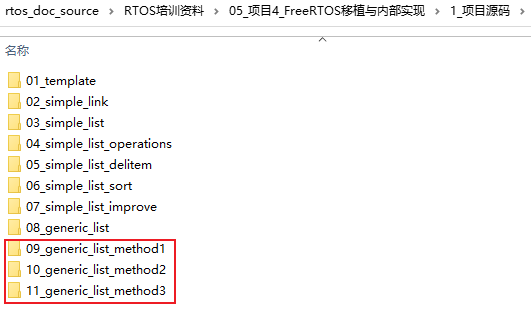

## 通用链表的三种实现方式

* 配套代码：
  

### 1. 引入概念container

```c
struct person {
    struct node_t node;
    char *name;
    int age;
};

struct dog {
    struct node_t node;
    char *name;
    int age;
    char *class;
};
```

person里含有node，person就是node的"容器"、"container"。

dog里含有node，dog就是node的"容器"、"container"。


核心在于：怎么根据node找到container。


### 2. 方法1

结构体中，node一定放在container中最前面：

```c
struct person {
    struct node_t node;
    char *name;
    int age;
};

struct dog {
    struct node_t node;
    char *name;
    int age;
    char *class;
};
```


### 3. 方法2

结构体中，根据node反算出container位置：

```c
struct person {
    char *name;
    int age;
    struct node_t node;
    char *address;
};

struct dog {
    char *name;
    int age;
    char *class;
    struct node_t node;    
};
```


### 4. 方法3

node中，保存container地址：

```c
struct node_t {
    void *container;
	struct node_t *next;
};

```


