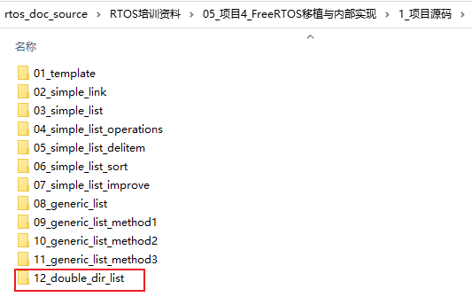

## 双向链表

* 对应源码
  

### 1. 结构图


### 2. 怎么判断尾部

上如中，person3是链表中最后一个链表项，它的下一个person是head：

```c
person3.node.next == &list.head
```


### 3. 怎么插入新项


```c
new_node->pre   = left_node;
new_node->next  = right_node;
left_node->next = new_node;
right_node->pre = new_node;
```


### 4. 怎么删除项


```c
left_node  = del_node->pre;
right_node = del_node->next;
left_node->next = right_node;
right_node->pre = left_node;
```

