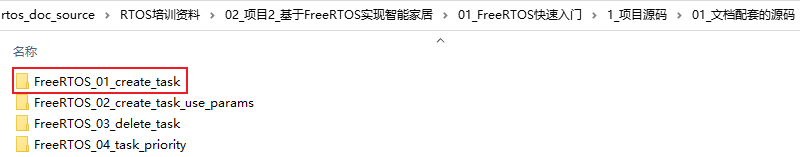
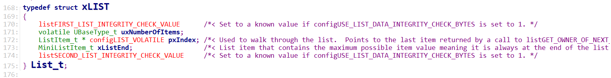
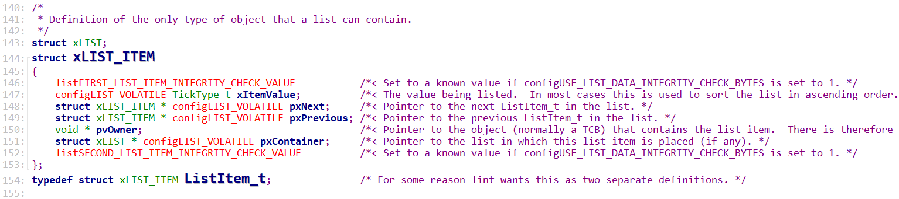
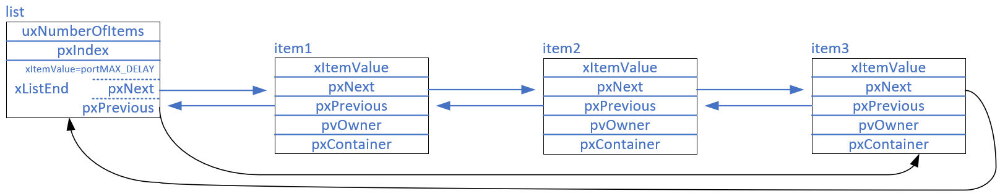
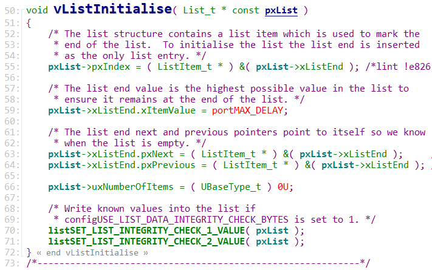
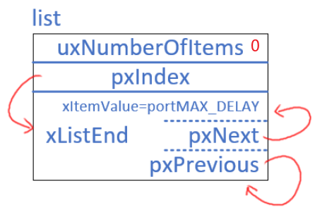

## FreeRTOS的链表代码分析

* 代码
  

### 1. 结构体

#### 1.1 链表

* uxNumberOfItems：链表中有多少个item
* pxIndex：指向当前正在使用的item，这个pxIndex被用来遍历链表

#### 1.2 链表项

* pvOwner：包含ITEM的结构体
* pxContainer：链表

### 2. 链表示意图

在上图中，链表中元素是顺序是：item1、item2、item3、xListEnd。

list中有一个pxIndex，指向当前真在使用的item。链表的遍历过程如下：

* pxIndex初始时指向xListEnd
* 要取出第一个元素时，pxIndex就会指向item1
* 再取出下一个元素时，pxIndex就会指向item2
* 再取出下一个元素时，pxIndex就会指向item3
* 再取出下一个元素时，pxIndex就会指向xListEnd
* 发现它是xListEnd时，继续去下一个元素，pxIndex就会指向item1

### 3. 链表操作函数

#### 3.1 初始化函数

List_t中有一个Item: xListEnd，初始化链表后，结果如下：

* uxNumberOfItems等于0，表示链表尾空，链表项的数量为0
* pxIndex指向xListEnd
* xListEnd中的pxNext、pxPrevious指向xListEnd
* xListEnd中的xItemValue等于portMAX_DELAY

#### 3.2 插入链表尾部

#### 3.3 按序插入链表

#### 3.4 在链表中删除项

