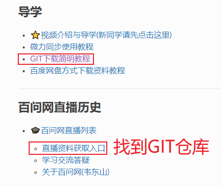
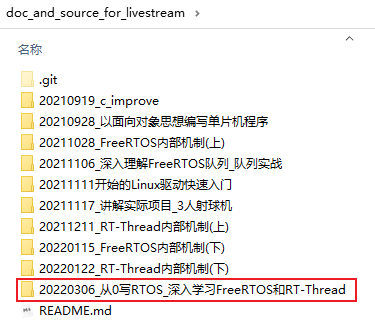
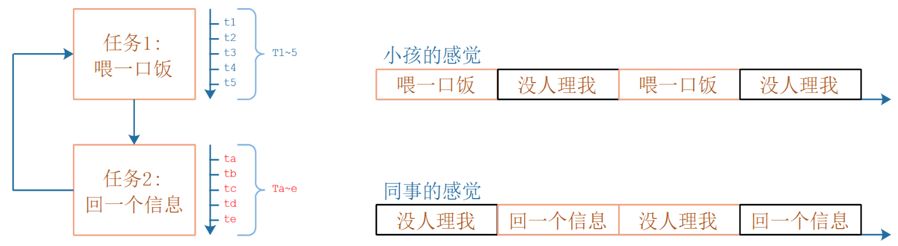

# 从0写RTOS_深入学习FreeRTOS和RT-Thread

## 1. 怎么学习RTOS

### 1.1 学习RTOS的3个层次

RTOS的学习我们分为3个层次：

* 层次1：知道使用API
* 层次2：知道API的内部机制
* 层次3：彻底掌握代码细节，能移植、能改进

对于FreeRTOS、RT-Thread，我们都有层次1、层次2的资料：

* 层次1：PDF文档和源码
  * 《FreeRTOS完全开发手册之快速入门》
  * 《RT-Thread完全开发手册之快速入门》
* 层次2：我们在www.100ask.net、B站、百度网盘都放有视频


### 1.2 今天，冲击第3层

上午：10-12点

* RTOS的引入：裸机无法解决的问题、使用RTOS编程更容易
* 你只需要掌握6条汇编指令
* 使用一个C函数理解汇编指令
* ARM架构过程调用标准AAPCS
* ARM架构简明教程：启动流程、中断处理流程

下午：14:00~16:00

* 实现RTOS的核心：保存、恢复现场
* RTOS编程：创建任务
* RTOS编程：启动任务
* RTOS编程：切换任务


### 1.3 资料下载

* 百问网www.100ask.net首页点击"资料下载"，可以看到：

  

* GIT简明教程(不会使用GIT的同学请看)：http://download.100ask.org/tools/Software/git/how_to_use_git.html

* GIT仓库：

  ```c
  git clone https://e.coding.net/weidongshan/livestream/doc_and_source_for_livestream.git
  ```

  


## 2. 裸机开发模式

### 2.1 轮询方式

```c
// 经典单片机程序
void main()
{
	while (1)
    {
        喂一口饭();
        回一个信息();
    }
}
```

缺点：函数之间互相有影响。




### 2.2 事件驱动方式

事件是一个宽泛的概念，什么叫事件？可以是：按下了按键、串口接收到了数据、模块产生了中断、某个全局变量被设置了。

什么叫事件驱动？当某个事件发生时，才调用对应函数，这就叫事件驱动。

比如上述的例子，我们可以这样写程序：

* 孩子喊叫时，再给他喂一口饭
* 同事发来信息电脑响时，再回复一个信息

写成程序就是这样：

```c
void main()
{
	while (1)
    {
        if (get_key)
            process_key();
    }
}

void key_isr() /* 孩子喊叫触发中断a */
{
    key = xxx;
    get_key = 1;
}

void b_isr() /* 同事发来信息触发中断b */
{
    回一个信息();
}
```

当这两个中断函数执行得都很快，这种编程方式很好。

如果a、b中断同时发生，就会互相影响：

* 两个中断，同一时间只能处理一个
* 如果当前中断处理时间比较长，就会影响到另一个中断的处理


### 2.3 改进的事件驱动方式

对于中断的处理，原则是"尽快"。否则会影响到其他中断，导致其他中断的处理被延迟、甚至丢失。

如果某些中断的处理确实比较慢，怎么办？

```c
void main()
{
	while (1)
    {
        if (crying == 1)
            喂一口饭();
        if (get_msg == 1)
            回一个信息();
    }
}

void a_isr() /* 孩子喊叫触发中断a */
{
    crying = 1;
}

void b_isr() /* 同事发来信息触发中断b */
{
    get_msg = 1;
}
```


可以解决中断的相应问题：中断处理很快，不会导致别的中断被延迟、丢失。

但是中断触发的后续处理退化为轮询方式！


### 2.4 常用事件驱动方式:定时器

上述例子中只有两个任务，如果有更多的任务，很多有经验的工程师会使用定时器来驱动：

* 设置一个定时器，比如每1ms产生一次中断
* 对于函数A，可以设置它的执行周期，比如每1ms执行一次
* 对于函数B，可以设置它的执行周期，比如每2ms执行一次
* 对于函数C，可以设置它的执行周期，比如每3ms执行一次
* **注意**：1ms、2ms、3ms只是假设，你可根据实际情况调整。

示例代码如下：

```c
typedef struct soft_timer {
    int remain;
    int period;
    void  (*function)(void);
}soft_timer, *p_soft_timer;

static soft_timer timers[] = {
    {1, 1, A},
    {2, 2, B},
    {3, 3, C},
};

void main()
{
	while (1)
    {
    }
}

void timer_isr() 
{
    int i;
	/* timers数组里每个成员的expire都减一 */
    for (i = 0; i < 3; i++)
        timers[i].remain--;
    
    /* 如果timers数组里某个成员的expire等于0:
     *   1. 调用它的函数
     *   2. 恢复expire为period
     */
    for (i = 0; i < 3; i++)
    {
        if (timers[i].remain == 0)
        {
            timer[i].function();
            timers[i].remain = timers[i].period;
        }
    }
}
```


上述例子中有三个函数：A、B、C。根据它们运行时消耗的时间调整运行周期，也可以达到比较好的效果。

但是，一旦某个函数执行的时间超长，就会有如下后果：

* 影响其他函数
* 延误整个时间基准


当然可以改进：

```c
typedef struct soft_timer {
    int remain;
    int period;
    void  (*function)(void);
}soft_timer, *p_soft_timer;

static soft_timer timers[] = {
    {1, 1, A},
    {2, 2, B},
    {3, 3, C},
};

void main()
{
    int i;
	while (1)
    {
        /* 如果timers数组里某个成员的expire等于0:
         *   1. 调用它的函数
         *   2. 恢复expire为period
         */
        for (i = 0; i < 3; i++)
        {
            if (timers[i].remain == 0)
            {
                timer[i].function();
                timers[i].remain = timers[i].period;
            }
        }
    }
}

void timer_isr() 
{
    int i;
	/* timers数组里每个成员的expire都减一 */
    for (i = 0; i < 3; i++)
        if (timers[i].remain)
	        timers[i].remain--;    
}
```

时间基准不会被耽误，A、B、C的调用再次退化为轮询方式，ABC相互之间有影响。


### 2.5 裸机程序的缺陷

假设要调用两个函数AB，AB执行的时间都很长，裸机就很难处理这种场景。

如果非要基于裸机解决这个问题的话，可以使用状态机。

示例代码如下：

```c

void feed_kid(void)
{
	static int state = 0;

	switch (state)
	{
		case 0: /* 开始 */
		{
			/* 盛饭 */
			state++;
			return;
		}

		case 1: /* 盛菜 */
		{
			/* 盛菜 */
			state++;
			return;
		}

		case 2: 
		{
			/* 拿勺子 */
			state++;
			return;
		}
		
	}
}

void send_msg(void)
{
	static int state = 0;

	switch (state)
	{
		case 0: /* 开始 */
		{
			/* 打开电脑 */
			state++;
			return;
		}

		case 1: 
		{
			/* 观看信息 */
			state++;
			return;
		}

		case 2: 
		{
			/* 打字 */
			state++;
			return;
		}
		
	}
}

void main()
{
	while (1)
    {
        feed_kid();
        send_msg();
    }
}
```

需要我们使用状态机拆分程序：

* 比较麻烦
* 有些复杂的程序无法拆分为状态机


基于裸机的程序框架无法完美地解决这类问题：复杂的、很耗时的多个函数。


## 3. RTOS的概念和引入

### 3.1 RTOS已经无处不在

单片机性能越来越强，很多Linux程序在单片机上也可以运行了：这需要RTOS。

我们要开发的单片机产品，功能也越来越丰富：这也需要RTOS。

就个人技术发展来说，单片机开发的技术提升方向之一就是RTOS。

RTOS已经无处不在：

* ESP8266 WIFI模块，出厂自带FreeRTOS，可以在上面做二次开发；
* 4G模块CAT1，出厂自带FreeRTOS，可以在上面做二次开发；
* 想实现功能比较丰富的设备时，比如加上MQTT功能，就需要RTOS
* 比如已经被RT-Thread采用的kawaii-mqtt，默认就不支持裸机
* 你去看所有的智能设备：小度音箱、小爱闹钟、家居摄像头，都使用RTOS。


### 3.2 RTOS的概念


#### 3.2.1 用人来类比单片机程序和RTOS


妈妈要一边给小孩喂饭，一边加班跟同事微信交流，怎么办？

##### 3.2.1.1 我无法一心多用

对于单线条的人，不能分心、不能同时做事，她只能这样做：

* 给小孩喂一口饭
* 瞄一眼电脑，有信息就去回复
* 再回来给小孩喂一口饭
* 如果小孩吃这口饭太慢，她回复同事的信息也就慢了，被同事催：你半天都不回我？
* 如果回复同事的信息要写一大堆，小孩就着急得大哭起来。

这种做法，在软件开发上就是一般的单片机开发，没有用操作系统。


##### 3.2.1.2 我可以一心多用

对于眼明手快的人，她可以一心多用，她这样做：

* 左手拿勺子，给小孩喂饭
* 右手敲键盘，回复同事
* 两不耽误，小孩“以为”妈妈在专心喂饭，同事“以为”她在专心聊天
* 但是脑子只有一个啊，虽然说“一心多用”，但是谁能同时思考两件事？
* 只是她反应快，上一秒钟在考虑夹哪个菜给小孩，下一秒钟考虑给同事回复什么信息

 

这种做法，在软件开发上就是使用操作系统，在单片机里叫做使用RTOS。

RTOS的意思是：Real-time operating system，实时操作系统。

我们使用的Windows也是操作系统，被称为通用操作系统。使用Windows时，我们经常碰到程序卡死、停顿的现象，日常生活中这可以忍受。

但是在电梯系统中，你按住开门键时如果没有即刻反应，即使只是慢个1秒，也会夹住人。

在专用的电子设备中，“实时性”很重要。


#### 3.2.2 程序简单示例

```c
// 经典单片机程序
void main()
{
	while (1)
    {
        喂一口饭();
        回一个信息();
    }
}
------------------------------------------------------
// RTOS程序    
喂饭()
{
    while (1)
    {
        喂一口饭();
    }
}

回信息()
{
    while (1)
    {
        回一个信息();
    }
}

void main()
{
    create_task(喂饭);
    create_task(回信息);
    start_scheduler();
    while (1)
    {
        sleep();
    }
}
```


 

### 3.3 使用RTOS的必要性

#### 3.3.1 裸机程序无法解决复杂问题


#### 3.3.2 使用RTOS写程序反而简单


#### 3.3.3 生态！

FreeRTOS

RT-Thread生态非常好。


