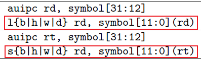

# 基于RISC-V的调试方法_修改BIN文件实现断点

## 1. 故障现象与解决思路

### 1.1 现象

在串口执行以下2个指令就可以触发bug：

```shell
# 检测OTA版本
ota_update_check
# 触发OTA升级
ota_download
```

错误信息如下：


从上面可以看到`exception pc => 0x800ded84`，根据这个地址值查看反汇编文件：

```shell
# 创建反汇编文件
risc-none-embed-objdump -D rtthread.elf > rtthread.dis
```


在串口打印的信息里，已经有一些提示，可以查看函数的调用关系：


结合源码可以知道这如下调用过程中出错：

```shell
ota_task_entry
	block_download_file
		fd = fopen(file_name, "wb+");
		...
		rt_kprintf("fd = %d", fd);
		fclose(fd);  // 在里面 __swrite 出错		
```

我们一般不会怀疑C库出错，那么可能是"fd被修改"了。

怎么验证这点？

添加打印？加了打印后错误就消除了。


### 1.2 思路

如果有JTAG工具，那么可以用它来调试。

没有JTAG工具，我们可以模拟JTAG调试的原理：修改bin文件，触发异常，在异常函数里打印信息。


### 1.3 先说Bug所在

在block_download_file调用其他函数时，会调用到如下函数。

它的局部数组recv_ip被越界访问了，破坏了block_download_file里的局部变量：fd。


### 1.4 确认问题


##  RISC-V架构简明教程

汇编指令、异常处理流程、函数调用规则。

### 2.1 硬件架构


修改变量a时，要先把a的值读入CPU存放在某个寄存器里，修改后再写会内存。

CPU内部的寄存器有哪些？


### 2.2 汇编指令

只需要掌握几条汇编指令即可：读/写内存、加法/减法、跳转、返回

* 读写内存指令
  

* 加法/减法：immediate是负数时就是减法
  

* 跳转：
  

* 返回
  


## 3. C语言本质

编写C函数，使用反汇编分析它的内部实现，理解局部变量的分配与使用、理解栈的作用、理解局部数组溢出的后果。

```c
int add_val(int a, int b)
{
	volatile int sum = 0;
    sum = a + b;
    return sum;
}

int overfow_test(int n, char c)
{
	char str[4] = "123";
    
    str[n] = c;
    
    rt_kprintf("%s\n", str);
}
```


## 4. 异常处理流程

### 4.1 硬件处理流程

发生异常时：

* 异常指令的PC被保存在mepc寄存器里
* 根据异常来源设置mcause寄存器
* 把空置状态寄存器mstatus的MIE位清零以禁止中断，并把之前的MIE值保存进MPIE里
* 发生异常之前的权限模式保存在mstatus的MPP域
* PC被设置为mtvec：mtvec寄存器里保存有异常处理函数的地址
* 使用mret指令返回
  * PC被设置为mepc
  * 将mstatus的MPIE域复制到MIE来恢复中断设置
  * 将权限模式设置为mstatus的MPP域


### 4.2 mtvec

RISC-V只有一个异常处理入口，记录在mtvec寄存器里，在这个寄存器里存有异常处理的总入口函数trap_entry：


### 4.3 入口函数功能

* 保存现场
* 分辨异常原因
* 处理异常
* 恢复现场

对于RT-Thread，已经有很完善的代码：

#### 4.3.1 保存浮点寄存器


#### 4.3.2 保存常规寄存器


#### 4.3.3 调用C函数


handle_trap函数原型如下：


展开细讲这几个参数，特别是sp，画图。


## 5. 修改BIN文件实现断点

### 5.1 原理

可以在代码里使用`ebreak`指令触发异常，在它的异常处理函数里，打印调试信息。

ebreak指令如下，它的机器码是：0x9002，两字节。


可以修改bin文件，把某条指令修改为0x9002，当运行到这条指令时就会触发异常。

在异常处理函数里就可以打印更多调试信息。


### 5.2 代码实现


### 5.3 测试


## 6. 改进: 打断点后能继续运行

这个Bug解决的难点在于：怎么找到修改了寄存器S10的函数。

S10是一个"被调用者保存"的寄存器，比如A函数调用B函数，A函数里把S10寄存器用作局部变量fd，B函数里也要使用S10，那么B函数就需要先把S10保存进栈里再使用它，B函数返回之前要从栈里恢复S10。

如果我们能在每个函数执行完毕、返回之前打断点，在断点处理函数里打印S10的值，就可以知道是不是它修改了S10。

假设有很长的调用关系：

```shell
A > B > C > D > E
```

你当然可以依次修改函数A、B、C、D、E的函数插入`ebreak`指令：

* 修改A函数插入`ebreak`指令，A执行到ebreak：打印S10的值，发现没被修改，恢复A函数
* 修改B函数插入`ebreak`指令，B执行到ebreak：打印S10的值，发现没被修改，恢复B函数
* 修改C函数插入`ebreak`指令，C执行到ebreak：打印S10的值，发现没被修改，恢复C函数
* 修改D函数插入`ebreak`指令，D执行到ebreak：打印S10的值，发现没被修改，恢复D函数
* 修改E函数插入`ebreak`指令，E执行到ebreak：打印S10的值，发现被修改，就知道E函数导致错误

在前面的代码了，打印S10后，程序就执行`while(1)`死机了。我们每次只能修改一个函数，效率太低。

如果能改进`ebreak`的异常处理函数：既能够打印S10的值，又能恢复程序的运行，效率就大为提高。

### 6.1 原理

对于risc-v系统，每个C函数的最后一条指令基本都是`ret`：


我们可以这样做：

* 修改bin文件，把C函数最后一条指令改为`ebreak`(机器码是0x9002)
* 程序执行到`ebreak`时触发异常
* 在`ebreak`异常函数里，打印调试信息
* 模拟`ret`指令的效果：
  * `ret`的作用是：pc=x1，就是跳转去执行x1及ra寄存器表示的函数
  * 异常处理完毕后恢复运行时，是从mepc表示的地址继续运行
  * 可以把mepc的值改为x1的值


### 6.2 代码实现


### 6.3 测试


## 7. 解决Bug演示

